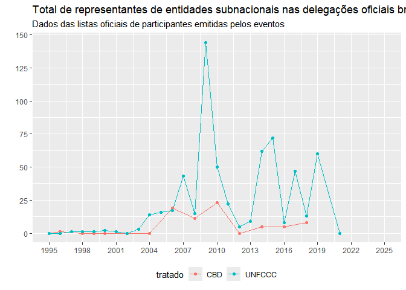
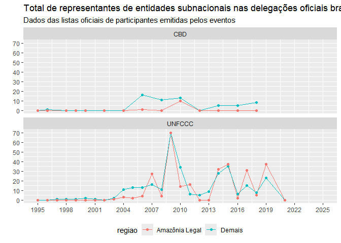
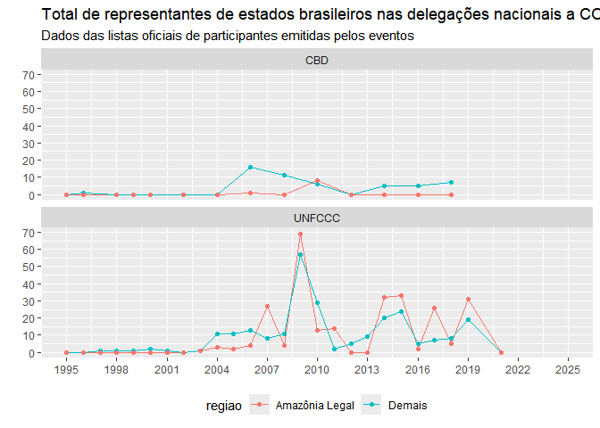
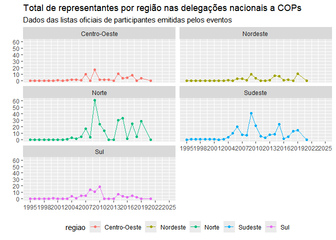
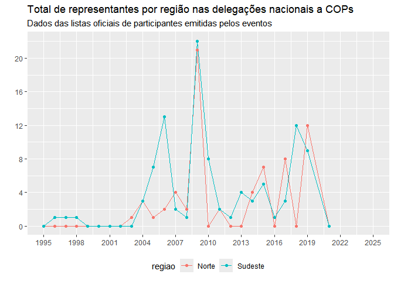

Dados do working paper _Diplomacia subnacional na Amazônia Legal em temas de clima e biodiversidade: um estudo comparativo (1995-2024)_.

**Abstract provisório:**

A escolha de Belém como sede da COP 30 lançou luz sobre a inserção de governos subnacionais nos debates sobre governança ambiental global. Apesar da longa história de atuação de governos subnacionais nesses temas, o destaque dado aos governos amazônicos é relativamente recente. Entes federativos do Sudeste foram, em outros momentos, mais ativos no debate global sobre política ambiental. Como e por que a atuação internacional de estados e municípios da Amazônia Legal nesses temas mudou ao longo dos anos? Em que medida suas estratégias e objetivos diferem das ações empreendidas por outras regiões brasileiras? Utilizando um banco de dados próprio que compila os participantes brasileiros em eventos multilaterais ambientais, mapeamos a participação de entidades subnacionais brasileiras nas Convenções de Clima e Biodiversidade da ONU entre 1995 e 2024. A partir desses dados, comparamos a frequência e o grau de prioridade (medido pelo número de representantes enviados e seu grau hierárquico) dado ao tema por estados e municípios da Amazônia Legal e de outras regiões do país. Para compreender melhor essas diferenças, desenvolvemos dois estudos de caso comparando estratégia e foco de atuação dos estados historicamente mais ativos em cada grupo, SP e AM. 


# Código


## Preparo da base
São usados os dados do banco de Atores e Eventos da PEB Ambiental, atualizando as delegações brasileiras enviadas à UNFCCC e CDB até 2024.

Relatório mais recente: "2025-05-30"


**Versão da planilha deleg**: 2023-12-20

**Versão da planilha orgs**: 2023-11-23, 2023-12-20

**Versão da planilha class**: 2022-06-29

**Versão da planilha eventos**: 2023-12-14


Iniciamos, portanto, com a importação dos dados da base.


``` r
## Importando os dados ------------
getlatest_file <- function(basefilename){
  list.files(pattern = paste0(basefilename, "-.+\\.csv"))
}

deleg <- read_delim(getlatest_file("deleg"), 
                    ";", escape_double = FALSE, 
                    col_types = cols(
                      #X1 = col_skip()
                      ), 
                    #locale = locale(encoding = "ISO-8859-1"), 
                    trim_ws = TRUE)

orgs <- read_delim(getlatest_file("orgs"), 
                   ";", escape_double = FALSE, 
                   col_types = cols(
                     #X1 = col_skip()
                     ), 
                   locale = locale(encoding = "UTF-8"),
                   trim_ws = TRUE) %>% distinct()

class <- read_delim(getlatest_file("class"), 
                   ";", escape_double = FALSE, 
                   col_types = cols(
                     #X1 = col_skip()
                     ), 
                   locale = locale(encoding = "ISO-8859-1"), 
                   trim_ws = TRUE) %>% distinct()


eventos <- read_delim(getlatest_file("eventos"),
                      ";", escape_double = FALSE, 
                      locale = locale(encoding = "UTF-8"), 
                      trim_ws = TRUE)
```

Em seguida, integramos e organizamos os dados


``` r
# Criando deleg_completo (deleg+orgs+class) --------
orgs_classificado <- left_join(orgs, class) %>% select(-c(org_sujo, org_detalhe_sujo))
# N de rows aumenta, porque tem orgs que ficaram apenas na class e saíram da lista orgs (foram erros na padronização e corrigidos posteriormente)
# Teste (resultado deve ser tibble vazio): left_join(orgs, class, by = "id_org_unica") %>% filter(org_limpo.x != org_limpo.y)

deleg_completo <- deleg %>% select(-c(org, org_detalhe)) %>% left_join(orgs_classificado, by = "id_org_dupla")

# Limpando deleg_completo
deleg_completo <- deleg_completo %>% mutate(across(where(is.character), str_trim))

rm(deleg, orgs, class)
```


``` r
# Limpando a base dos eventos --------

### Limpar e renomear colunas
eventos <- eventos %>% 
   #retira colunas irrelevantes
  select(-c(5,8,9,15,16,17,18)) %>% # indexar por nome não estava funcionando
  # select(-c(`Código ONU`, `Comentário`,
  #           `Formato lista`, `Aberto?`, `Questões a atentar`,
  #           Corrigendum, Local)) %>%
    
    rename(#renomeia colunas
    conf = `Nome do evento`,
    conference = `Conf/Conv`,
    tema = `Regime/Tema`,
    data = Data,
    location = Locale,
    tipo_evento = `Tipo evento`,
    infMEA_list = `Lista MEA?`,
    coleta = `Coleta?`,
    proces = `Proces.?`,
    mainconf = `Principais convenções + gdes conf`
  )

eventos <- eventos %>% mutate(
  data = if_else(str_count(data)==4, #se falta o mês (só ano)
                 paste0(data, "-01"), #padroniza como janeiro
                 data)) %>% 
  mutate(
    data = if_else(is.na(data)== F,
                   paste0(data, "-01"), #padroniza data no dia 1 do mês
                   data)
  ) %>% mutate(data = lubridate::ymd(data), 
               ano = lubridate::year(lubridate::ymd(data))) 

eventos <- eventos %>% mutate(across(where(is.character), str_trim))
```


``` r
#preparar a base do tamanho deleg
deleg_evento <- left_join(deleg_completo,
                          select(eventos, c(conf, tema, ano, tipo_evento, infMEA_list)))

# identificando os eventos p/ os quais o BR nao enviou delegação:
eventos_semdeleg <- tibble(conf = setdiff(eventos[eventos$coleta=="Sim" & !is.na(eventos$coleta),]$conf, unique(deleg_completo$conf))) %>% 
  left_join(eventos) %>% 
  mutate(count = 0)

# contagem de tamanho da delegação, incluindo eventos acima como deleg_size = 0
deleg_size <- deleg_evento %>% group_by(conf, ano) %>% summarize(count = n()) %>% 
  bind_rows(select(eventos_semdeleg, c(conf, ano, count)))
```

Podemos, agora, filtrar apenas os eventos e participantes relevantes para nosso estudo: a) as COPs de Clima e Biodiversidade e b) os participantes vinculados a órgãos subnacionais.


``` r
bd <- deleg_completo %>% filter(str_detect(conf, "(UNFCCC|CBD)")) %>% 
  group_by(conf) %>% mutate(BRdeleg_size = n()) %>% ungroup() %>% 
  filter(tipo_org_reduzido == "Governos subnacionais (Executivo, Legislativo, Empresas Públicas ou Autarquias)") %>% 
  select(-c(cargo_deleg, pais, nline, fonte, id_org_dupla, org_detalhe_limpo, tipo_org, tipo_org_reduzido))

bd <- left_join(bd, select(eventos, c(conf, data, location, tipo_evento, ano)))
```

```
## Joining with `by = join_by(conf)`
```


``` r
eventos_relevantes <- eventos %>% filter(str_detect(conf, "(UNFCCC|CBD)")) %>% 
  select(conf, data, location, tipo_evento, ano) %>% 
  mutate(tratado = if_else(str_detect(conf, "UNFCCC"), "UNFCCC", "CBD"))

# orgs_subnac <- orgs_classificado %>% filter(tipo_org_reduzido == "Governos subnacionais (Executivo, Legislativo, Empresas Públicas ou Autarquias)") %>% select(id_org_unica, org_limpo) %>% distinct()
# Incluí manualmente informação sobre ser Amazonia Legal ou não em orgs_subnac
orgs_subnac <- read_csv2(here::here("orgs_subnac.csv"))
```

```
## ℹ Using "','" as decimal and "'.'" as grouping mark. Use `read_delim()` for more control.
```

```
## Rows: 86 Columns: 6
## ── Column specification ────────────────────────────────────────────────────────
## Delimiter: ";"
## chr (3): org_limpo, tipo, sigla_estado
## dbl (1): id_org_unica
## lgl (2): misclass_drop, amz_legal
## 
## ℹ Use `spec()` to retrieve the full column specification for this data.
## ℹ Specify the column types or set `show_col_types = FALSE` to quiet this message.
```


``` r
# identifiquei alguns erros do banco que precisam ser corrigidos
# enquanto nao atualizo os dados no banco original, fazemos nesse tratamento:
bd <- bd %>% 
  mutate(id_org_unica = if_else(id_org_unica == 241, 226, id_org_unica),
                    org_limpo = if_else(id_org_unica == 241, "Estado de Mato Grosso", org_limpo)) %>% 
  mutate(id_org_unica = if_else(id_org_unica == 484, 493, id_org_unica),
                    org_limpo = if_else(id_org_unica == 484, "Município do Rio de Janeiro", org_limpo))

# retira orgs que nao deveriam estar na lista
bd <- bd %>% filter(! id_org_unica %in% (filter(orgs_subnac, misclass_drop) %>% pull(id_org_unica)) )
```


## Evolução da participação ao longo do tempo


``` r
subnacdeleg_size <- bd %>% group_by(conf, id_org_unica) %>% summarise(org_deleg_size = n()) %>% 
  # completar orgs e eventos com org_deleg size = 0
  ungroup() %>% complete(conf = eventos_relevantes$conf, 
                         id_org_unica, fill = list(org_deleg_size = 0)) %>% 
  # calcular total de subnacionais como soma das individuais
  group_by(conf) %>% mutate(subnacdeleg_size = sum(org_deleg_size)) %>% ungroup() %>% 
  left_join(eventos_relevantes) %>% left_join(orgs_subnac) #incluir detalhes
```

```
## `summarise()` has grouped output by 'conf'. You can override using the
## `.groups` argument.
## Joining with `by = join_by(conf)`
## Joining with `by = join_by(id_org_unica)`
```

### Nº total de participantes subnacionais


``` r
# grafico
ggplot(subnacdeleg_size, aes(x = ano, y = subnacdeleg_size, color = tratado)) +
  geom_line() + geom_point() +
  labs(title = "Total de representantes de entidades subnacionais nas delegações oficiais brasileiras a COPs",
       subtitle = "Dados das listas oficiais de participantes emitidas pelos eventos") +
  scale_y_continuous(n.breaks = 8, name = "") +
  scale_x_continuous(name = NULL, n.breaks = 12, limits = c(1995, 2025)) +
  theme(legend.position = "bottom")
```

```
## Warning: Removed 1550 rows containing missing values or values outside the scale range
## (`geom_line()`).
```

```
## Warning: Removed 1550 rows containing missing values or values outside the scale range
## (`geom_point()`).
```

<!-- -->

### Divisão por região


``` r
subnacdeleg_size %>% filter(!is.na(amz_legal)) %>% 
  group_by(conf, amz_legal) %>% 
  summarise(amz_deleg_size = sum(org_deleg_size)) -> amz_deleg_size
```

```
## `summarise()` has grouped output by 'conf'. You can override using the
## `.groups` argument.
```

``` r
amz_deleg_size <- left_join(amz_deleg_size, eventos_relevantes)
```

```
## Joining with `by = join_by(conf)`
```

``` r
amz_deleg_size <- amz_deleg_size %>% mutate(regiao = if_else(amz_legal, "Amazônia Legal","Demais"))

# tst <- amz_deleg_size %>% select(-amz_legal) %>%
#   pivot_wider(names_from = regiao, values_from = amz_deleg_size) %>%
#   mutate(total = Demais + `Amazônia Legal`) %>% 
#   pivot_longer(c(Demais, `Amazônia Legal`, total), names_to = "regiao", values_to = "value")

amz_deleg_size %>% 
  ggplot(aes(x = ano, y = amz_deleg_size, color = regiao)) +
  geom_line() + geom_point() +
  facet_wrap(~tratado, ncol = 1) +
  labs(title = "Total de representantes de entidades subnacionais nas delegações oficiais brasileiras a COPs",
       subtitle = "Dados das listas oficiais de participantes emitidas pelos eventos") +
  scale_y_continuous(n.breaks = 8, name = "") +
  scale_x_continuous(name = NULL, n.breaks = 12, limits = c(1995, 2025)) +
  theme(legend.position = "bottom")
```

```
## Warning: Removed 22 rows containing missing values or values outside the scale range
## (`geom_line()`).
```

```
## Warning: Removed 50 rows containing missing values or values outside the scale range
## (`geom_point()`).
```

<!-- -->


``` r
# (dividir total e só estados)
estadosdeleg_size <- subnacdeleg_size %>% filter(!is.na(amz_legal)) %>% filter(tipo == "estado") %>% 
  group_by(conf, amz_legal) %>% 
  summarise(amz_deleg_size = sum(org_deleg_size))
```

```
## `summarise()` has grouped output by 'conf'. You can override using the
## `.groups` argument.
```

``` r
estadosdeleg_size <- left_join(estadosdeleg_size, eventos_relevantes)
```

```
## Joining with `by = join_by(conf)`
```

``` r
estadosdeleg_size <- estadosdeleg_size %>% mutate(regiao = if_else(amz_legal, "Amazônia Legal","Demais"))


estadosdeleg_size %>% 
  ggplot(aes(x = ano, y = amz_deleg_size, color = regiao)) +
  geom_line() + geom_point() +
  facet_wrap(~tratado, ncol = 1) +
  labs(title = "Total de representantes de estados brasileiros nas delegações nacionais a COPs",
       subtitle = "Dados das listas oficiais de participantes emitidas pelos eventos") +
  scale_y_continuous(n.breaks = 8, name = "") +
  scale_x_continuous(name = NULL, n.breaks = 12, limits = c(1995, 2025)) +
  theme(legend.position = "bottom")
```

```
## Warning: Removed 22 rows containing missing values or values outside the scale range
## (`geom_line()`).
```

```
## Warning: Removed 50 rows containing missing values or values outside the scale range
## (`geom_point()`).
```

<!-- -->


``` r
estado_regiao <- orgs_subnac %>% 
  select(sigla_estado) %>% distinct() %>% 
  mutate(regiao = case_when(sigla_estado %in% c("AC", "AM", "RO", "RR", "PA", "AP", "TO") ~ "Norte",
                            sigla_estado %in% c("MA","PI", "CE","RN","PB",
                                                "PE","AL","SE","BA") ~ "Nordeste",
                            sigla_estado %in% c("MT", "MS", "GO", "DF") ~ "Centro-Oeste",
                            sigla_estado %in% c("MG", "ES", "RJ", "SP") ~ "Sudeste",
                            sigla_estado %in% c("PR", "SC", "RS") ~ "Sul",
                            ))

subnacdeleg_size %>% left_join(estado_regiao) %>% 
  filter(!is.na(regiao)) %>% group_by(ano, regiao) %>% 
  summarise(deleg_size = sum(org_deleg_size)) %>% 
  # left_join(eventos_relevantes) %>% 
  ggplot(aes(x = ano, y = deleg_size, color = regiao)) +
  geom_line() + geom_point() +
  # facet_wrap(~tratado, ncol = 1) +
  facet_wrap(~regiao, ncol = 2) +
  labs(title = "Total de representantes por região nas delegações nacionais a COPs",
       subtitle = "Dados das listas oficiais de participantes emitidas pelos eventos") +
  scale_y_continuous(n.breaks = 8, name = "") +
  scale_x_continuous(name = NULL, n.breaks = 12, limits = c(1995, 2025)) +
  theme(legend.position = "bottom")
```

```
## Joining with `by = join_by(sigla_estado)`
## `summarise()` has grouped output by 'ano'. You can override using the `.groups`
## argument.
```

```
## Warning: Removed 30 rows containing missing values or values outside the scale range
## (`geom_line()`).
```

```
## Warning: Removed 30 rows containing missing values or values outside the scale range
## (`geom_point()`).
```

<!-- -->

``` r
subnacdeleg_size %>% left_join(estado_regiao) %>% 
  filter(regiao == c("Sudeste", "Norte")) %>% group_by(ano, regiao) %>% 
  summarise(deleg_size = sum(org_deleg_size)) %>% 
  # left_join(eventos_relevantes) %>% 
  ggplot(aes(x = ano, y = deleg_size, color = regiao)) +
  geom_line() + geom_point() +
  # facet_wrap(~tratado, ncol = 1) +
  labs(title = "Total de representantes por região nas delegações nacionais a COPs",
       subtitle = "Dados das listas oficiais de participantes emitidas pelos eventos") +
  scale_y_continuous(n.breaks = 8, name = "") +
  scale_x_continuous(name = NULL, n.breaks = 12, limits = c(1995, 2025)) +
  theme(legend.position = "bottom")
```

```
## Joining with `by = join_by(sigla_estado)`
## `summarise()` has grouped output by 'ano'. You can override using the `.groups`
## argument.
```

```
## Warning: Removed 12 rows containing missing values or values outside the scale range
## (`geom_line()`).
```

```
## Warning: Removed 12 rows containing missing values or values outside the scale range
## (`geom_point()`).
```

<!-- -->


### Top estados / top municipios

``` r
# AmzLegal entra de alguma forma no gráfico (cor, tracejado, tipo de ponto)
# dúvida sobre Clima x CBD

# top X estados ao longo do tempo
# top X municipios ao longo do tempo 
```

## Participação geral


``` r
# sem olhar evoluçao temporal, n munic por regiao/AmzLegal
```


``` r
# (tabelas diferentes por tratado)
# row = estado, col = n por ano e total?
# possibilidade: fazer mapa(s) no futuro com isso
```

