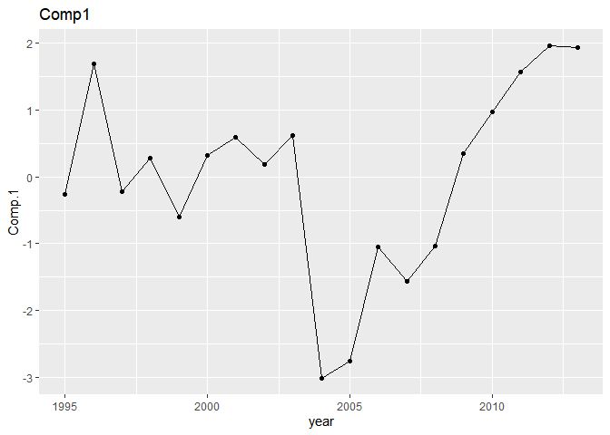
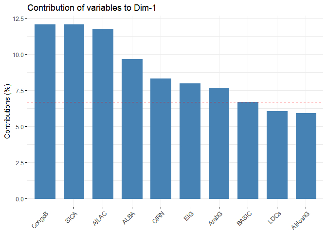

``` r
library(tidyverse)
```

```
## Warning: package 'ggplot2' was built under R version 4.3.3
```

```
## Warning: package 'tidyr' was built under R version 4.3.3
```

```
## ── Attaching core tidyverse packages ──────────────────────── tidyverse 2.0.0 ──
## ✔ dplyr     1.1.4     ✔ readr     2.1.5
## ✔ forcats   1.0.0     ✔ stringr   1.5.1
## ✔ ggplot2   3.5.1     ✔ tibble    3.2.1
## ✔ lubridate 1.9.3     ✔ tidyr     1.3.1
## ✔ purrr     1.0.2     
## ── Conflicts ────────────────────────────────────────── tidyverse_conflicts() ──
## ✖ dplyr::filter() masks stats::filter()
## ✖ dplyr::lag()    masks stats::lag()
## ℹ Use the conflicted package (<http://conflicted.r-lib.org/>) to force all conflicts to become errors
```

Open files from Castro database (.dta)


``` r
relationdb <- haven::read_dta(here::here("dbs","Castro", "ENB_relationships.dta"))
```

# Cooperation index
Generate the cooperation index.

First, we filter statements by Brazil (sender, C1) or about Brazil (target, C2)

``` r
BR_statements <- relationdb %>% filter(Country1 == "Brazil" | Country2 == "Brazil")
```

Calculating scores for agreement with G77 countries
How much does BRA agree to G77 countries? (0 = not g77, 1= g77 member, 2= g77 itself)


``` r
BR_statements %>% filter(Country1 == "Brazil") %>% 
  mutate(cooperation = if_else(cooperation == 0, -1, 1)) %>% 
  group_by(G77_target, year) %>% 
  summarise(coop_score = sum(cooperation), weighted_score = sum(relation))
```

```
## `summarise()` has grouped output by 'G77_target'. You can override using the
## `.groups` argument.
```

<div data-pagedtable="false">
  <script data-pagedtable-source type="application/json">
{"columns":[{"label":["G77_target"],"name":[1],"type":["dbl"],"align":["right"]},{"label":["year"],"name":[2],"type":["dbl"],"align":["right"]},{"label":["coop_score"],"name":[3],"type":["dbl"],"align":["right"]},{"label":["weighted_score"],"name":[4],"type":["dbl"],"align":["right"]}],"data":[{"1":"0","2":"1995","3":"23","4":"202"},{"1":"0","2":"1996","3":"13","4":"50"},{"1":"0","2":"1997","3":"0","4":"50"},{"1":"0","2":"1998","3":"1","4":"34"},{"1":"0","2":"1999","3":"17","4":"116"},{"1":"0","2":"2000","3":"4","4":"222"},{"1":"0","2":"2001","3":"-3","4":"48"},{"1":"0","2":"2002","3":"-1","4":"46"},{"1":"0","2":"2003","3":"9","4":"45"},{"1":"0","2":"2004","3":"-6","4":"123"},{"1":"0","2":"2005","3":"5","4":"16"},{"1":"0","2":"2006","3":"-1","4":"35"},{"1":"0","2":"2007","3":"3","4":"59"},{"1":"0","2":"2008","3":"-4","4":"178"},{"1":"0","2":"2009","3":"5","4":"794"},{"1":"0","2":"2010","3":"-19","4":"287"},{"1":"0","2":"2011","3":"6","4":"150"},{"1":"0","2":"2012","3":"7","4":"66"},{"1":"0","2":"2013","3":"4","4":"47"},{"1":"1","2":"1995","3":"40","4":"246"},{"1":"1","2":"1996","3":"34","4":"134"},{"1":"1","2":"1997","3":"9","4":"56"},{"1":"1","2":"1998","3":"16","4":"60"},{"1":"1","2":"1999","3":"23","4":"99"},{"1":"1","2":"2000","3":"49","4":"221"},{"1":"1","2":"2001","3":"15","4":"54"},{"1":"1","2":"2002","3":"10","4":"60"},{"1":"1","2":"2003","3":"5","4":"28"},{"1":"1","2":"2004","3":"5","4":"26"},{"1":"1","2":"2005","3":"2","4":"6"},{"1":"1","2":"2006","3":"5","4":"39"},{"1":"1","2":"2007","3":"5","4":"75"},{"1":"1","2":"2008","3":"25","4":"206"},{"1":"1","2":"2009","3":"151","4":"840"},{"1":"1","2":"2010","3":"61","4":"334"},{"1":"1","2":"2011","3":"80","4":"378"},{"1":"1","2":"2012","3":"63","4":"208"},{"1":"1","2":"2013","3":"48","4":"123"},{"1":"2","2":"1995","3":"5","4":"32"},{"1":"2","2":"1996","3":"3","4":"8"},{"1":"2","2":"1997","3":"0","4":"8"},{"1":"2","2":"1998","3":"2","4":"4"},{"1":"2","2":"1999","3":"1","4":"2"},{"1":"2","2":"2000","3":"7","4":"24"},{"1":"2","2":"2001","3":"1","4":"4"},{"1":"2","2":"2003","3":"2","4":"7"},{"1":"2","2":"2008","3":"3","4":"12"},{"1":"2","2":"2009","3":"15","4":"52"},{"1":"2","2":"2010","3":"2","4":"8"},{"1":"2","2":"2011","3":"1","4":"4"},{"1":"2","2":"2012","3":"1","4":"4"},{"1":"2","2":"2013","3":"4","4":"12"}],"options":{"columns":{"min":{},"max":[10]},"rows":{"min":[10],"max":[10]},"pages":{}}}
  </script>
</div>

We will calculate the cooperation index with a general function that takes country grouping as an argument.


``` r
calculate_coop <- function(grouping, country = "Brazil", 
                           statementsdb = relationdb, aggregateby = "year"){

  sender = paste0(grouping, "_sender")
  target = paste0(grouping, "_target")
  countryid_send = statementsdb[statementsdb$Country1 == country, "country1"] %>% 
    unique %>% haven::zap_labels() %>% pull(country1)
  countryid_targ = statementsdb[statementsdb$Country2 == country, "country2"] %>%
    unique %>% haven::zap_label() %>% pull(country2)
  
  
  #Count statements sent or targeting the country
  country_sentstatements <- statementsdb %>% filter(country1 == countryid_send) %>%
    group_by(!!rlang::parse_quo(aggregateby, #parse_quo faz string -> expressao
                                env = rlang::caller_env())) %>%  summarise(n_send = n())
    # group_by(aggregateby) %>%  summarise(n_send = n())
  country_tgtstatements <- statementsdb %>% filter(country2 == countryid_targ) %>%
    group_by(!!rlang::parse_quo(aggregateby, #parse_quo faz string -> expressao
                                env = rlang::caller_env())) %>%  summarise(n_targ = n())
    # group_by(aggregateby) %>%  summarise(n_targ = n())
  country_totalstatements <- left_join(country_sentstatements, country_tgtstatements) %>%
    mutate(state_total = n_send + n_targ)

  
  statementsdb %>% 
    #filter statements
    filter(Country1 == country | Country2 == country) %>% 
    # fuse sender and target
    # (include both directions of relations to grouping)
    mutate( {{grouping}} := 
              # chaves e := é pra variável ser mutável cf arg
              case_when(
                # 2 = grouping spokesman
                !!rlang::parse_quo(sender, #parse_quo faz string -> expressao
                                   env = rlang::caller_env()) == 2 |
                  !!rlang::parse_quo(target, 
                                     env = rlang::caller_env()) == 2 ~ 2,
                # 1 = country in grouping
                # since analyzed country can be in grouping, disconsider 
                # when send/targ is the country analysed
                !!rlang::parse_quo(sender, env = rlang::caller_env()) == 1 &
                  country1 != countryid_send | !!rlang::parse_quo(target, 
                                                                  env = rlang::caller_env()) == 1 &
                  country2 != countryid_targ ~ 1,
                
                # 0 = not in grouping
                !!rlang::parse_quo(sender, env = rlang::caller_env()) == 0 &
                  country1 != countryid_send | !!rlang::parse_quo(target, 
                                                                  env = rlang::caller_env()) == 0 &
                  country2 != countryid_targ ~ 0
              )
    ) %>% 
    #summarise scores
    group_by(!!rlang::parse_quo(grouping, env = rlang::caller_env()), 
             !!rlang::parse_quo(aggregateby, env = rlang::caller_env())
             #aggregateby
             ) %>%
    summarise(coop_score = sum(cooperation),
              weighted_score = sum(relation)) %>%
    pivot_wider(names_from = !!rlang::parse_quo(grouping, env = rlang::caller_env()),
                 values_from = c(coop_score, weighted_score)) %>% 
    replace(is.na(.), 0) %>% #NA coded as 0
    left_join(country_totalstatements) %>% # include data on n of statements
    mutate(country = {{country}},
           grouping = {{grouping}}
           ) # %>% 
    # mutate(coop_score = sum(coop_score_2, coop_score_1, - coop_score_0, na.rm = T),
    #        # weighted_score = sum(weighted_score_2, weighted_score_1, - weighted_score_0,
    #        #                   na.rm = T)
    #        ) %>% 
    # # relativize_scores
    # left_join(country_totalstatements) %>%
    # mutate(coop_avg = coop_score/state_total,
    #        # weighted_score_avg = weighted_score/state_total
    #        ) %>% 
    # mutate(grouping = {{grouping}})
    
}
```

We then use the _finish_coop_scores()_ function to calculate two versions for the index. The first uses a simplified version of Castro's data, which uses unweighted interactions (relation is binary - cooperation or conflict). The second uses Castro's weight scheme for relations, which differentiates the intensity of cooperation/conflict in each interaction.

``` r
finish_coop_scores <- function(coopdb){
  column_checker <- tibble(coop_score_0=numeric(),
                           coop_score_1=numeric(), 
                           coop_score_2=numeric(),
                           weighted_score_2=numeric(), 
                           weighted_score_1=numeric(),
                           weighted_score_0=numeric()
  )
  
  coopdb %>% left_join(column_checker) %>% 
  mutate(coop_score = coop_score_2 + coop_score_1 - coop_score_0,
         weighted_score = weighted_score_2 + weighted_score_1 - weighted_score_0
         ) %>%
  # relativize_scores
  mutate(coop_avg = coop_score/state_total,
         weighted_score_avg = weighted_score/state_total
         )
}
```

Now we can calculate cooperation scores for various groupings


``` r
BReu <- calculate_coop("EU", "Brazil", relationdb) %>% finish_coop_scores()
```

```
## Joining with `by = join_by(year)`
## `summarise()` has grouped output by 'EU'. You can override using the `.groups`
## argument.
## Joining with `by = join_by(year)`
## Joining with `by = join_by(coop_score_0, coop_score_1, coop_score_2,
## weighted_score_0, weighted_score_1, weighted_score_2)`
```

``` r
BRaosis <- calculate_coop("AOSIS", "Brazil", relationdb) %>% finish_coop_scores()
```

```
## Joining with `by = join_by(year)`
## `summarise()` has grouped output by 'AOSIS'. You can override using the
## `.groups` argument.
## Joining with `by = join_by(year)`
## Joining with `by = join_by(coop_score_0, coop_score_1, coop_score_2,
## weighted_score_0, weighted_score_1, weighted_score_2)`
```

``` r
BRg77 <- calculate_coop("G77", "Brazil", relationdb) %>% finish_coop_scores()
```

```
## Joining with `by = join_by(year)`
## `summarise()` has grouped output by 'G77'. You can override using the `.groups`
## argument.
## Joining with `by = join_by(year)`
## Joining with `by = join_by(coop_score_0, coop_score_1, coop_score_2,
## weighted_score_0, weighted_score_1, weighted_score_2)`
```

``` r
BRbasic <- calculate_coop( "BASIC", "Brazil", relationdb) %>% finish_coop_scores()
```

```
## Joining with `by = join_by(year)`
## `summarise()` has grouped output by 'BASIC'. You can override using the
## `.groups` argument.
## Joining with `by = join_by(year)`
## Joining with `by = join_by(coop_score_0, coop_score_1, coop_score_2,
## weighted_score_0, weighted_score_1, weighted_score_2)`
```


## Figures for disaggregated cooperation scores


``` r
bind_rows(BReu, BRg77, BRaosis) %>% ggplot(aes(x=year, color = grouping)) + 
  geom_line(aes(y = coop_avg)) + geom_hline(yintercept = 0, color = "red") +
  geom_vline(xintercept = c(1999, 2003, 2007, 2011), linetype = 'dashed') +
  geom_point(aes(y = coop_avg)) +
  scale_x_discrete(limits = c(1995, 1997, 1999, 2001, 
                              2003, 2005, 2007, 2009, 2011, 2013)) +
  ggtitle("Brazil average cooperation score at UNFCCC") +
  theme(legend.position = 'bottom')
```

```
## Warning in scale_x_discrete(limits = c(1995, 1997, 1999, 2001, 2003, 2005, : Continuous limits supplied to discrete scale.
## ℹ Did you mean `limits = factor(...)` or `scale_*_continuous()`?
```

<!-- -->

``` r
bind_rows(BReu, BRaosis) %>% ggplot(aes(x=year, color = grouping)) + 
  geom_line(aes(y = coop_avg)) + geom_hline(yintercept = 0, color = "red") +
  geom_vline(xintercept = c(1999, 2003, 2007, 2011), linetype = 'dashed') +
  geom_point(aes(y = coop_avg)) +
  scale_x_discrete(limits = c(1995, 1997, 1999, 2001, 
                              2003, 2005, 2007, 2009, 2011, 2013)) +
  ggtitle("Brazil average cooperation score at UNFCCC") +
  theme(legend.position = 'bottom')
```

```
## Warning in scale_x_discrete(limits = c(1995, 1997, 1999, 2001, 2003, 2005, : Continuous limits supplied to discrete scale.
## ℹ Did you mean `limits = factor(...)` or `scale_*_continuous()`?
```

<!-- -->

``` r
bind_rows(BRg77, BRbasic) %>% ggplot(aes(x=year, color = grouping)) + 
  geom_line(aes(y = coop_avg)) + geom_hline(yintercept = 0, color = "red") +
  geom_point(aes(y = coop_avg)) +
  geom_vline(xintercept = c(1999, 2003, 2007, 2011), linetype = 'dashed') +
  scale_x_discrete(limits = c(1995, 1997, 1999, 2001, 
                              2003, 2005, 2007, 2009, 2011, 2013)) +
  ggtitle("Brazil average cooperation score at UNFCCC") +
  theme(legend.position = 'bottom')
```

```
## Warning in scale_x_discrete(limits = c(1995, 1997, 1999, 2001, 2003, 2005, : Continuous limits supplied to discrete scale.
## ℹ Did you mean `limits = factor(...)` or `scale_*_continuous()`?
```

<!-- -->


``` r
bind_rows(BReu, BRg77, BRaosis, BRbasic) %>% ggplot(aes(x=year, color = grouping)) + 
  geom_line(aes(y = coop_avg)) + geom_hline(yintercept = 0, color = "red") +
  geom_point(aes(y = coop_avg)) +
  geom_vline(xintercept = c(1999, 2003, 2007, 2011), linetype = 'dashed') +
  scale_x_discrete(limits = c(1995, 1997, 1999, 2001, 
                              2003, 2005, 2007, 2009, 2011, 2013)) +
  facet_wrap(~grouping, ncol = 1) +
  ggtitle("Brazil average cooperation score at UNFCCC") +
  theme(legend.position = 'right')
```

```
## Warning in scale_x_discrete(limits = c(1995, 1997, 1999, 2001, 2003, 2005, : Continuous limits supplied to discrete scale.
## ℹ Did you mean `limits = factor(...)` or `scale_*_continuous()`?
```

<!-- -->


As a "placebo", we will also add cooperation data for US and Indonesia -- in which we expect changes not to coincide with those in the centrality of Brazilian ministries

``` r
useu <- calculate_coop("EU", "United States", relationdb) %>% finish_coop_scores()
```

```
## Joining with `by = join_by(year)`
## `summarise()` has grouped output by 'EU'. You can override using the `.groups`
## argument.
## Joining with `by = join_by(year)`
## Joining with `by = join_by(coop_score_0, coop_score_1, coop_score_2,
## weighted_score_0, weighted_score_1, weighted_score_2)`
```

``` r
usg77 <- calculate_coop("G77", "United States", relationdb) %>% finish_coop_scores()
```

```
## Joining with `by = join_by(year)`
## `summarise()` has grouped output by 'G77'. You can override using the `.groups`
## argument.
## Joining with `by = join_by(year)`
## Joining with `by = join_by(coop_score_0, coop_score_1, coop_score_2,
## weighted_score_0, weighted_score_1, weighted_score_2)`
```

``` r
usaosis <- calculate_coop("AOSIS", "United States", relationdb) %>% finish_coop_scores()
```

```
## Joining with `by = join_by(year)`
## `summarise()` has grouped output by 'AOSIS'. You can override using the
## `.groups` argument.
## Joining with `by = join_by(year)`
## Joining with `by = join_by(coop_score_0, coop_score_1, coop_score_2,
## weighted_score_0, weighted_score_1, weighted_score_2)`
```

``` r
bind_rows(useu, usg77, usaosis) %>% ggplot(aes(x=year, color = grouping)) + 
  geom_line(aes(y = coop_avg)) + geom_hline(yintercept = 0, color = "red") +
  geom_point(aes(y = coop_avg)) +
  geom_vline(xintercept = c(1997, 2001, 2005, 2009), linetype = 'dashed') +
  scale_x_discrete(limits = c(1995, 1997, 1999, 2001, 
                              2003, 2005, 2007, 2009, 2011, 2013)) +
  ggtitle("US average cooperation score at UNFCCC") +
  theme(legend.position = 'bottom')
```

```
## Warning in scale_x_discrete(limits = c(1995, 1997, 1999, 2001, 2003, 2005, : Continuous limits supplied to discrete scale.
## ℹ Did you mean `limits = factor(...)` or `scale_*_continuous()`?
```

<!-- -->


``` r
idneu <- calculate_coop("EU", "Indonesia", relationdb) %>% finish_coop_scores()
```

```
## Joining with `by = join_by(year)`
## `summarise()` has grouped output by 'EU'. You can override using the `.groups`
## argument.
## Joining with `by = join_by(year)`
## Joining with `by = join_by(coop_score_0, coop_score_1, coop_score_2,
## weighted_score_0, weighted_score_1, weighted_score_2)`
```

``` r
idng77 <- calculate_coop("G77", "Indonesia", relationdb) %>% finish_coop_scores()
```

```
## Joining with `by = join_by(year)`
## `summarise()` has grouped output by 'G77'. You can override using the `.groups`
## argument.
## Joining with `by = join_by(year)`
## Joining with `by = join_by(coop_score_0, coop_score_1, coop_score_2,
## weighted_score_0, weighted_score_1, weighted_score_2)`
```

``` r
idnaosis <- calculate_coop("AOSIS", "Indonesia", relationdb) %>% finish_coop_scores()
```

```
## Joining with `by = join_by(year)`
## `summarise()` has grouped output by 'AOSIS'. You can override using the
## `.groups` argument.
## Joining with `by = join_by(year)`
## Joining with `by = join_by(coop_score_0, coop_score_1, coop_score_2,
## weighted_score_0, weighted_score_1, weighted_score_2)`
```

``` r
bind_rows(useu, usg77, usaosis) %>% ggplot(aes(x=year, color = grouping)) + 
  geom_line(aes(y = coop_avg)) + geom_hline(yintercept = 0, color = "red") +
  geom_point(aes(y = coop_avg)) +
  geom_vline(xintercept = c(1997, 2001, 2005, 2009), linetype = 'dashed') +
  scale_x_discrete(limits = c(1995, 1997, 1999, 2001, 
                              2003, 2005, 2007, 2009, 2011, 2013)) +
  ggtitle("Indonesia average cooperation score at UNFCCC") +
  theme(legend.position = 'bottom')
```

```
## Warning in scale_x_discrete(limits = c(1995, 1997, 1999, 2001, 2003, 2005, : Continuous limits supplied to discrete scale.
## ℹ Did you mean `limits = factor(...)` or `scale_*_continuous()`?
```

<!-- -->


# Create index with PCA

(possible reference for improving figures: https://www.benjaminbell.co.uk/2018/02/principal-components-analysis-pca-in-r.html)


We will first compute the cooperation score for Brazil and all possible coalitions.


``` r
coalitions <- c("AILAC", "ALBA", "AOSIS", "AfricanG", "ArabG", "BASIC", "COMIFAC", "CaribbeanC",
                "CentralAm", "CentralG11", "CfRN", "CongoB", "EITs", "EU", "EIG", "G77",
                "G9", #"CACAM",
                "LDCs", "LMDC", "Mountain", "OPEC", "SICA", "SAfricaDC",
                "Umbrella", "Visegrad"#, "AsianG"
                )

df <- map_df(coalitions, calculate_coop)
```

```
## Joining with `by = join_by(year)`
## `summarise()` has grouped output by 'AILAC'. You can override using the
## `.groups` argument.
## Joining with `by = join_by(year)`
## Joining with `by = join_by(year)`
## `summarise()` has grouped output by 'ALBA'. You can override using the
## `.groups` argument.
## Joining with `by = join_by(year)`
## Joining with `by = join_by(year)`
## `summarise()` has grouped output by 'AOSIS'. You can override using the
## `.groups` argument.
## Joining with `by = join_by(year)`
## Joining with `by = join_by(year)`
## `summarise()` has grouped output by 'AfricanG'. You can override using the
## `.groups` argument.
## Joining with `by = join_by(year)`
## Joining with `by = join_by(year)`
## `summarise()` has grouped output by 'ArabG'. You can override using the
## `.groups` argument.
## Joining with `by = join_by(year)`
## Joining with `by = join_by(year)`
## `summarise()` has grouped output by 'BASIC'. You can override using the
## `.groups` argument.
## Joining with `by = join_by(year)`
## Joining with `by = join_by(year)`
## `summarise()` has grouped output by 'COMIFAC'. You can override using the
## `.groups` argument.
## Joining with `by = join_by(year)`
## Joining with `by = join_by(year)`
## `summarise()` has grouped output by 'CaribbeanC'. You can override using the
## `.groups` argument.
## Joining with `by = join_by(year)`
## Joining with `by = join_by(year)`
## `summarise()` has grouped output by 'CentralAm'. You can override using the
## `.groups` argument.
## Joining with `by = join_by(year)`
## Joining with `by = join_by(year)`
## `summarise()` has grouped output by 'CentralG11'. You can override using the
## `.groups` argument.
## Joining with `by = join_by(year)`
## Joining with `by = join_by(year)`
## `summarise()` has grouped output by 'CfRN'. You can override using the
## `.groups` argument.
## Joining with `by = join_by(year)`
## Joining with `by = join_by(year)`
## `summarise()` has grouped output by 'CongoB'. You can override using the
## `.groups` argument.
## Joining with `by = join_by(year)`
## Joining with `by = join_by(year)`
## `summarise()` has grouped output by 'EITs'. You can override using the
## `.groups` argument.
## Joining with `by = join_by(year)`
## Joining with `by = join_by(year)`
## `summarise()` has grouped output by 'EU'. You can override using the `.groups`
## argument.
## Joining with `by = join_by(year)`
## Joining with `by = join_by(year)`
## `summarise()` has grouped output by 'EIG'. You can override using the `.groups`
## argument.
## Joining with `by = join_by(year)`
## Joining with `by = join_by(year)`
## `summarise()` has grouped output by 'G77'. You can override using the `.groups`
## argument.
## Joining with `by = join_by(year)`
## Joining with `by = join_by(year)`
## `summarise()` has grouped output by 'G9'. You can override using the `.groups`
## argument.
## Joining with `by = join_by(year)`
## Joining with `by = join_by(year)`
## `summarise()` has grouped output by 'LDCs'. You can override using the
## `.groups` argument.
## Joining with `by = join_by(year)`
## Joining with `by = join_by(year)`
## `summarise()` has grouped output by 'LMDC'. You can override using the
## `.groups` argument.
## Joining with `by = join_by(year)`
## Joining with `by = join_by(year)`
## `summarise()` has grouped output by 'Mountain'. You can override using the
## `.groups` argument.
## Joining with `by = join_by(year)`
## Joining with `by = join_by(year)`
## `summarise()` has grouped output by 'OPEC'. You can override using the
## `.groups` argument.
## Joining with `by = join_by(year)`
## Joining with `by = join_by(year)`
## `summarise()` has grouped output by 'SICA'. You can override using the
## `.groups` argument.
## Joining with `by = join_by(year)`
## Joining with `by = join_by(year)`
## `summarise()` has grouped output by 'SAfricaDC'. You can override using the
## `.groups` argument.
## Joining with `by = join_by(year)`
## Joining with `by = join_by(year)`
## `summarise()` has grouped output by 'Umbrella'. You can override using the
## `.groups` argument.
## Joining with `by = join_by(year)`
## Joining with `by = join_by(year)`
## `summarise()` has grouped output by 'Visegrad'. You can override using the
## `.groups` argument.
## Joining with `by = join_by(year)`
```

``` r
df <- finish_coop_scores(df)
```

```
## Joining with `by = join_by(coop_score_0, coop_score_1, coop_score_2,
## weighted_score_0, weighted_score_1, weighted_score_2)`
```

``` r
df <- select(df, -c(coop_score_0, coop_score_1, weighted_score_0, weighted_score_1,
                weighted_score_2, n_send, n_targ, state_total))
```

## Main PCA  - AOSIS, EU, G77, BASIC

For PCA, we need to first standardize the data. For this, we will work with Brazilian average cooperation score for AOSIS, EU, G77, and BASIC countries.

``` r
df_num <- df %>% 
  select(-c(weighted_score, weighted_score_avg, coop_score, coop_score_2)) %>% #calcular c/ coop_avg
  # filter(year == 1995) %>% # separar o ano (se nao quiser rodar PCA p/ todos dados juntos)
  pivot_wider(names_from = "grouping", values_from = "coop_avg") %>% 
  select(-c(year, country)) %>% # remover as colunas não numéricas
  scale() %>% as_tibble() %>% 
  select(AOSIS, EU, G77, BASIC)
```

For diagnostics, we can see the correlation matrix for each grouping:

``` r
df_num %>% 
  cor(use="pairwise") %>% round(1) %>% ggcorrplot::ggcorrplot(type = 'lower',
                                                                      lab = T)
```

<!-- -->

We can now compute principal components

``` r
library(stats)
pca <- princomp(df_num, fix_sign = F)
#rev nao afeta resultado, é só por preferencia estetica na interpretaçao do eixo (na figura final)
```


``` r
summary(pca, loadings = T, cutoff = 0.3)
```

```
## Importance of components:
##                           Comp.1    Comp.2     Comp.3     Comp.4
## Standard deviation     1.3902981 1.1188255 0.59729275 0.49801188
## Proportion of Variance 0.5100784 0.3303283 0.09414464 0.06544862
## Cumulative Proportion  0.5100784 0.8404067 0.93455138 1.00000000
## 
## Loadings:
##       Comp.1 Comp.2 Comp.3 Comp.4
## AOSIS -0.569 -0.355  0.500 -0.547
## EU    -0.572        -0.762       
## G77    0.561 -0.394 -0.344 -0.642
## BASIC        -0.796         0.530
```

### Diagnostics


``` r
library(factoextra)
```

```
## Warning: package 'factoextra' was built under R version 4.3.3
```

```
## Welcome! Want to learn more? See two factoextra-related books at https://goo.gl/ve3WBa
```

``` r
get_eigenvalue(pca)
```

<div data-pagedtable="false">
  <script data-pagedtable-source type="application/json">
{"columns":[{"label":[""],"name":["_rn_"],"type":[""],"align":["left"]},{"label":["eigenvalue"],"name":[1],"type":["dbl"],"align":["right"]},{"label":["variance.percent"],"name":[2],"type":["dbl"],"align":["right"]},{"label":["cumulative.variance.percent"],"name":[3],"type":["dbl"],"align":["right"]}],"data":[{"1":"1.9329287","2":"51.007842","3":"51.00784","_rn_":"Dim.1"},{"1":"1.2517705","2":"33.032832","3":"84.04067","_rn_":"Dim.2"},{"1":"0.3567586","2":"9.414464","3":"93.45514","_rn_":"Dim.3"},{"1":"0.2480158","2":"6.544862","3":"100.00000","_rn_":"Dim.4"}],"options":{"columns":{"min":{},"max":[10]},"rows":{"min":[10],"max":[10]},"pages":{}}}
  </script>
</div>

``` r
fviz_eig(pca, addlabels = T, ylim = c(0, 50))
```

<!-- -->
To interpret the dimensions more meaningfully, we can see that the 1st dimension is mainly driven by convergence with AOSIS/EU/G77, while the second dimension is mostly related to convergence with BASIC.

``` r
fviz_pca_biplot(pca, repel = F, col.var = "black", col.ind = "gray")
```

<!-- -->

``` r
fviz_contrib(pca, choice = "var", axes = 1, top = 10)
```

<!-- -->

``` r
fviz_contrib(pca, choice = "var", axes = 2, top = 10)
```

<!-- -->

``` r
fviz_contrib(pca, choice = "var", axes = 3, top = 10)
```

<!-- -->


### Visualizing the data

We can plot data with the two main components as axes. We can see that, within Cardoso and Rousseff governments, positions tend to be relatively stable. Lula, however, changes a lot - esp. within the first term.

``` r
df_pca <- pca$scores %>% as_tibble()
df_pca$year <- 1995:2013 #reinclude year column
df_pca <- df_pca %>% mutate(governo = case_when(year >= 1995 & year < 1999 ~ "Cardoso 1",
                                                year >= 1999 & year < 2003 ~ "Cardoso 2",
                                                year >= 2003 & year < 2007 ~ "Lula 1",
                                                year >= 2007 & year < 2011 ~ "Lula 2",
                                                year >= 2011 & year < 2014 ~ "Rousseff 1"))

df_pca %>%
  ggplot(aes(x=Comp.1, y =Comp.2, color = governo, label = as.character(year))) + 
  geom_point() + geom_text() +
  ggtitle("PCA components") +
  xlab("Dim1 (51% variance) - EU/AOSIS-G77") + #xlim(-3.3,3.3) +
  ylab("Dim2 (21% variance) - BASIC") #+ ylim(-3,3)
```

<!-- -->

We can also check the yearly evolution of each component.


``` r
df_pca %>% ggplot(aes(x=year, y =Comp.1)) + geom_line() + geom_point() + ggtitle("Comp1")
```

<!-- -->

``` r
df_pca %>% ggplot(aes(x=year, y =Comp.2)) + geom_line() + geom_point() + ggtitle("Comp2")
```

<!-- -->

``` r
df_pca %>% ggplot(aes(x=year, y =Comp.3)) + geom_line() + geom_point() + ggtitle("Comp3")
```

<!-- -->

Create a good visualization of the 1st component

``` r
df_pca %>%
  arrange(year) %>%
  ggplot(aes(x=year, y = GGally::rescale01(Comp.1))) + 
  geom_line() + geom_point() +
  geom_vline(xintercept = c(1999, 2003, 2007, 2011), 
             color = "darkgray", linetype = "dashed") +
  scale_x_continuous(breaks = c(1995, 1999, 2003, 2007, 2011, 2014))  +
  ylab("BR Position index") + #ylim(-1, 1) +
  theme(legend.position = 'bottom', axis.title.x = element_blank()) +
  ggtitle("Brazil position - PCA 1st component (51% of variation)",
  subtitle = "positive = close to G77, negative = close to EU/AOSIS\n PCA of cooperation with EU, AOSIS, BASIC and G77")
```

```
## Registered S3 method overwritten by 'GGally':
##   method from   
##   +.gg   ggplot2
```

<!-- -->

``` r
df_pca %>%
  arrange(year) %>% mutate(rescC = GGally::rescale01(Comp.1)) %>% 
  ggplot(aes(x=year, y = rescC - lag(rescC))) + 
  geom_line() + geom_point() +
  geom_vline(xintercept = c(1999, 2003, 2007, 2011), 
             color = "darkgray", linetype = "dashed") +
  geom_hline(yintercept = 0, color = "black", linetype = "dashed") +
  scale_x_continuous(breaks = c(1995, 1999, 2003, 2007, 2011, 2014))  +
  ylab("BR Position index") + #ylim(-1, 1) +
  theme(legend.position = 'bottom', axis.title.x = element_blank()) +
  ggtitle("Yearly variation in Brazil position - PCA 1st component")
```

```
## Warning: Removed 1 row containing missing values or values outside the scale range
## (`geom_line()`).
```

```
## Warning: Removed 1 row containing missing values or values outside the scale range
## (`geom_point()`).
```

<!-- -->


Or generate an index that aggregates the components


``` r
df_pca %>%
  mutate(components_multiplied = (.51*Comp.1 + .33*Comp.2 + .09*Comp.3)/.93) %>% #only EU, AOSIS, BASIC, G77
  arrange(year) %>%
  mutate(components_multiplied = GGally::rescale01(components_multiplied)) %>%
  ggplot(aes(x=year, y = components_multiplied)) +
  geom_line() + geom_point() +
  geom_vline(xintercept = c(1999, 2003, 2007, 2011), 
             color = "darkgray", linetype = "dashed") +
  scale_x_continuous(breaks = c(1995, 1999, 2003, 2007, 2011, 2014))  +
  ylab("BR Position index") + #ylim(-1, 1) +
  theme(legend.position = 'bottom', axis.title.x = element_blank()) +
  ggtitle("Brazilian cooperation with groupings at UNFCCC",
  subtitle = "PCA, first three components (93,4% of variance)")
```

<!-- -->

``` r
df_pca %>%
  mutate(components_multiplied = (.51*Comp.1 + .33*Comp.2 + .09*Comp.3)/.93) %>% #only EU, AOSIS, BASIC, G77
  arrange(year) %>%
  mutate(components_multiplied = GGally::rescale01(components_multiplied)) %>%
  ggplot(aes(x=year, y = components_multiplied - lag(components_multiplied))) +
  geom_line() + geom_point() +
  geom_hline(yintercept = 0, color = "black", linetype = "dashed") +
  geom_vline(xintercept = c(1999, 2003, 2007, 2011), 
             color = "darkgray", linetype = "dashed") +
  scale_x_continuous(breaks = c(1995, 1999, 2003, 2007, 2011, 2014))  +
  ylab("BR Position index") + #ylim(-1, 1) +
  theme(legend.position = 'bottom', axis.title.x = element_blank()) +
  ggtitle("Yearly variation in Brazilian cooperation with groupings at UNFCCC",
  subtitle = "PCA, first three components (93,4% of variance)")
```

```
## Warning: Removed 1 row containing missing values or values outside the scale range
## (`geom_line()`).
```

```
## Warning: Removed 1 row containing missing values or values outside the scale range
## (`geom_point()`).
```

<!-- -->


Might be interesting to generate this for other groupings. Test PCA without BASIC, adding more groupings, etc
How robust are our results to this?

## Reduced PCA Index - EU, AOSIS, G77
Do results change if we remove BASIC from the data?


``` r
df_nobasic <- df %>% 
  select(-c(weighted_score, weighted_score_avg, coop_score, coop_score_2)) %>% #calcular c/ coop_avg
  # filter(year == 1995) %>% # separar o ano (se nao quiser rodar PCA p/ todos dados juntos)
  pivot_wider(names_from = "grouping", values_from = "coop_avg") %>% 
  select(-c(year, country)) %>% # remover as colunas não numéricas
  scale() %>% as_tibble() %>% 
  select(AOSIS, EU, G77)

pca_nobasic <- princomp(df_nobasic, fix_sign = F) 
summary(pca_nobasic, loadings = T, cutoff = 0.3)
```

```
## Importance of components:
##                           Comp.1    Comp.2    Comp.3
## Standard deviation     1.3798130 0.7758587 0.5798833
## Proportion of Variance 0.6698851 0.2117996 0.1183153
## Cumulative Proportion  0.6698851 0.8816847 1.0000000
## 
## Loadings:
##       Comp.1 Comp.2 Comp.3
## AOSIS -0.609  0.334  0.719
## EU    -0.603  0.394 -0.694
## G77    0.515  0.856
```

### Diagnostics

``` r
get_eigenvalue(pca_nobasic)
```

<div data-pagedtable="false">
  <script data-pagedtable-source type="application/json">
{"columns":[{"label":[""],"name":["_rn_"],"type":[""],"align":["left"]},{"label":["eigenvalue"],"name":[1],"type":["dbl"],"align":["right"]},{"label":["variance.percent"],"name":[2],"type":["dbl"],"align":["right"]},{"label":["cumulative.variance.percent"],"name":[3],"type":["dbl"],"align":["right"]}],"data":[{"1":"1.9038839","2":"66.98851","3":"66.98851","_rn_":"Dim.1"},{"1":"0.6019568","2":"21.17996","3":"88.16847","_rn_":"Dim.2"},{"1":"0.3362646","2":"11.83153","3":"100.00000","_rn_":"Dim.3"}],"options":{"columns":{"min":{},"max":[10]},"rows":{"min":[10],"max":[10]},"pages":{}}}
  </script>
</div>

``` r
fviz_eig(pca_nobasic, addlabels = T, ylim = c(0, 50))
```

<!-- -->

``` r
fviz_pca_biplot(pca_nobasic, repel = F, col.var = "black", col.ind = "gray")
```

<!-- -->
### Results


``` r
df_pca_nobasic <- pca_nobasic$scores %>% as_tibble()
df_pca_nobasic$year <- 1995:2013 #reinclude year column
df_pca_nobasic <- df_pca_nobasic %>% mutate(governo = case_when(year >= 1995 & year < 1999 ~ "Cardoso 1",
                                                year >= 1999 & year < 2003 ~ "Cardoso 2",
                                                year >= 2003 & year < 2007 ~ "Lula 1",
                                                year >= 2007 & year < 2011 ~ "Lula 2",
                                                year >= 2011 & year < 2014 ~ "Rousseff 1"))

df_pca_nobasic %>%
  ggplot(aes(x=Comp.1, y =Comp.2, color = governo, label = as.character(year))) + 
  geom_point() + geom_text() +
  ggtitle("PCA components") +
  xlab("Dim1 (67% variance) - EU/AOSIS-G77") + #xlim(-3.3,3.3) +
  ylab("Dim2 (21% variance)") #+ ylim(-3,3)
```

<!-- -->

``` r
df_pca_nobasic %>% ggplot(aes(x=year, y =Comp.1)) + geom_line() + geom_point() + ggtitle("Comp1")
```

<!-- -->

``` r
df_pca_nobasic %>% ggplot(aes(x=year, y =Comp.2)) + geom_line() + geom_point() + ggtitle("Comp2")
```

<!-- -->

``` r
df_pca_nobasic %>% ggplot(aes(x=year, y =Comp.3)) + geom_line() + geom_point() + ggtitle("Comp3")
```

<!-- -->


Create a good visualization of the 1st component

``` r
df_pca_nobasic %>%
  arrange(year) %>%
  ggplot(aes(x=year, y = GGally::rescale01(Comp.1))) + 
  geom_line() + geom_point() +
  geom_vline(xintercept = c(1999, 2003, 2007, 2011), 
             color = "darkgray", linetype = "dashed") +
  scale_x_continuous(breaks = c(1995, 1999, 2003, 2007, 2011, 2014))  +
  ylab("BR Position index") + #ylim(-1, 1) +
  theme(legend.position = 'bottom', axis.title.x = element_blank()) +
  ggtitle("Brazil position - PCA 1st component (67% of variation)",
  subtitle = "positive = close to G77, negative = close to EU/AOSIS\n PCA of cooperation with EU, AOSIS, BASIC and G77")
```

<!-- -->

``` r
df_pca_nobasic %>%
  arrange(year) %>% mutate(rescC = GGally::rescale01(Comp.1)) %>% 
  ggplot(aes(x=year, y = rescC - lag(rescC))) + 
  geom_line() + geom_point() +
  geom_vline(xintercept = c(1999, 2003, 2007, 2011), 
             color = "darkgray", linetype = "dashed") +
  geom_hline(yintercept = 0, color = "black", linetype = "dashed") +
  scale_x_continuous(breaks = c(1995, 1999, 2003, 2007, 2011, 2014))  +
  ylab("BR Position index") + #ylim(-1, 1) +
  theme(legend.position = 'bottom', axis.title.x = element_blank()) +
  ggtitle("Yearly variation in Brazil position - PCA 1st component")
```

```
## Warning: Removed 1 row containing missing values or values outside the scale range
## (`geom_line()`).
```

```
## Warning: Removed 1 row containing missing values or values outside the scale range
## (`geom_point()`).
```

<!-- -->


Or generate an index that aggregates the components


``` r
df_pca_nobasic %>%
  mutate(components_multiplied = (.67*Comp.1 + .21*Comp.2 + .12*Comp.3)) %>% #only EU, AOSIS, G77
  arrange(year) %>%
  mutate(components_multiplied = GGally::rescale01(components_multiplied)) %>%
  ggplot(aes(x=year, y = components_multiplied)) +
  geom_line() + geom_point() +
  geom_vline(xintercept = c(1999, 2003, 2007, 2011), 
             color = "darkgray", linetype = "dashed") +
  scale_x_continuous(breaks = c(1995, 1999, 2003, 2007, 2011, 2014))  +
  ylab("BR Position index") + #ylim(-1, 1) +
  theme(legend.position = 'bottom', axis.title.x = element_blank()) +
  ggtitle("Brazilian cooperation with groupings at UNFCCC",
  subtitle = "PCA, first three components (100% of variance)")
```

<!-- -->

``` r
df_pca_nobasic %>%
  mutate(components_multiplied = (.67*Comp.1 + .21*Comp.2 + .12*Comp.3)) %>%
  arrange(year) %>%
  mutate(components_multiplied = GGally::rescale01(components_multiplied)) %>%
  ggplot(aes(x=year, y = components_multiplied - lag(components_multiplied))) +
  geom_line() + geom_point() +
  geom_hline(yintercept = 0, color = "black", linetype = "dashed") +
  geom_vline(xintercept = c(1999, 2003, 2007, 2011), 
             color = "darkgray", linetype = "dashed") +
  scale_x_continuous(breaks = c(1995, 1999, 2003, 2007, 2011, 2014))  +
  ylab("BR Position index") + #ylim(-1, 1) +
  theme(legend.position = 'bottom', axis.title.x = element_blank()) +
  ggtitle("Yearly variation in Brazilian cooperation with groupings at UNFCCC",
  subtitle = "PCA, first three components (100% of variance)")
```

```
## Warning: Removed 1 row containing missing values or values outside the scale range
## (`geom_line()`).
```

```
## Warning: Removed 1 row containing missing values or values outside the scale range
## (`geom_point()`).
```

<!-- -->


## Expanded PCA Index - EU, AOSIS, G77, BASIC, AILAC, ALBA, UMBRELLA, EIG, ArabG, AfricanG
Do results change if we add other coalitions?


``` r
df_expanded <- df %>% 
  select(-c(weighted_score, weighted_score_avg, coop_score, coop_score_2)) %>% #calcular c/ coop_avg
  # filter(year == 1995) %>% # separar o ano (se nao quiser rodar PCA p/ todos dados juntos)
  pivot_wider(names_from = "grouping", values_from = "coop_avg") %>% 
  select(-c(year, country)) %>% # remover as colunas não numéricas
  scale() %>% as_tibble() %>% 
  select(AOSIS, EU, G77, BASIC, AILAC, ALBA, Umbrella, EIG, ArabG, AfricanG)

pca_expanded <- princomp(df_expanded, fix_sign = F) 
summary(pca_expanded, loadings = T, cutoff = 0.3)
```

```
## Importance of components:
##                           Comp.1    Comp.2    Comp.3     Comp.4     Comp.5
## Standard deviation     2.0887809 1.5414573 1.1674513 0.78680070 0.62243890
## Proportion of Variance 0.4605395 0.2508096 0.1438662 0.06534473 0.04089541
## Cumulative Proportion  0.4605395 0.7113490 0.8552152 0.92055993 0.96145534
##                            Comp.6    Comp.7      Comp.8     Comp.9     Comp.10
## Standard deviation     0.37332185 0.3346000 0.246183517 0.22381223 0.055994317
## Proportion of Variance 0.01471119 0.0118177 0.006397334 0.00528748 0.000330955
## Cumulative Proportion  0.97616653 0.9879842 0.994381565 0.99966904 1.000000000
## 
## Loadings:
##          Comp.1 Comp.2 Comp.3 Comp.4 Comp.5 Comp.6 Comp.7 Comp.8 Comp.9 Comp.10
## AOSIS            0.418 -0.371                0.515  0.440                      
## EU       -0.309  0.398                      -0.682                             
## G77             -0.582               -0.337                      -0.548        
## BASIC    -0.323 -0.321        -0.433  0.339                0.595               
## AILAC    -0.447                                                         -0.801 
## ALBA     -0.392               -0.343                      -0.779               
## Umbrella                0.781         0.301  0.323                             
## EIG      -0.375                                    -0.625        -0.535        
## ArabG    -0.364                      -0.643        -0.373         0.421        
## AfricanG -0.317                0.717  0.449                       0.305
```

### Diagnostics

Interpretação da dimensão 1 está bem menos clara agora. A dimensão 2 parece ser algo como CBDR e commitments.

``` r
get_eigenvalue(pca_expanded)
```

<div data-pagedtable="false">
  <script data-pagedtable-source type="application/json">
{"columns":[{"label":[""],"name":["_rn_"],"type":[""],"align":["left"]},{"label":["eigenvalue"],"name":[1],"type":["dbl"],"align":["right"]},{"label":["variance.percent"],"name":[2],"type":["dbl"],"align":["right"]},{"label":["cumulative.variance.percent"],"name":[3],"type":["dbl"],"align":["right"]}],"data":[{"1":"4.363005647","2":"46.0539485","3":"46.05395","_rn_":"Dim.1"},{"1":"2.376090507","2":"25.0809554","3":"71.13490","_rn_":"Dim.2"},{"1":"1.362942548","2":"14.3866158","3":"85.52152","_rn_":"Dim.3"},{"1":"0.619055347","2":"6.5344731","3":"92.05599","_rn_":"Dim.4"},{"1":"0.387430178","2":"4.0895408","3":"96.14553","_rn_":"Dim.5"},{"1":"0.139369202","2":"1.4711194","3":"97.61665","_rn_":"Dim.6"},{"1":"0.111957180","2":"1.1817702","3":"98.79842","_rn_":"Dim.7"},{"1":"0.060606324","2":"0.6397334","3":"99.43816","_rn_":"Dim.8"},{"1":"0.050091914","2":"0.5287480","3":"99.96690","_rn_":"Dim.9"},{"1":"0.003135364","2":"0.0330955","3":"100.00000","_rn_":"Dim.10"}],"options":{"columns":{"min":{},"max":[10]},"rows":{"min":[10],"max":[10]},"pages":{}}}
  </script>
</div>

``` r
fviz_eig(pca_expanded, addlabels = T, ylim = c(0, 50))
```

<!-- -->

``` r
fviz_pca_biplot(pca_expanded, repel = F, col.var = "black", col.ind = "gray")
```

<!-- -->

``` r
fviz_contrib(pca_expanded, choice = "var", axes = 1, top = 10)
```

<!-- -->

``` r
fviz_contrib(pca_expanded, choice = "var", axes = 2, top = 10)
```

<!-- -->

``` r
fviz_contrib(pca_expanded, choice = "var", axes = 3, top = 10)
```

<!-- -->


### Results


``` r
df_pca_expanded <- pca_expanded$scores %>% as_tibble()
df_pca_expanded$year <- 1995:2013 #reinclude year column
df_pca_expanded <- df_pca_expanded %>% mutate(governo = case_when(year >= 1995 & year < 1999 ~ "Cardoso 1",
                                                year >= 1999 & year < 2003 ~ "Cardoso 2",
                                                year >= 2003 & year < 2007 ~ "Lula 1",
                                                year >= 2007 & year < 2011 ~ "Lula 2",
                                                year >= 2011 & year < 2014 ~ "Rousseff 1"))

df_pca_expanded %>%
  ggplot(aes(x=Comp.1, y =Comp.2, color = governo, label = as.character(year))) + 
  geom_point() + geom_text() +
  ggtitle("PCA components") +
  xlab("Dim1 (46% variance)") + #xlim(-3.3,3.3) +
  ylab("Dim2 (25% variance) - G77 x AOSIS") #+ ylim(-3,3)
```

<!-- -->

``` r
df_pca_expanded %>% ggplot(aes(x=year, y =Comp.1)) + geom_line() + geom_point() + ggtitle("Comp1")
```

<!-- -->

``` r
df_pca_expanded %>% ggplot(aes(x=year, y =Comp.2)) + geom_line() + geom_point() + ggtitle("Comp2")
```

<!-- -->

``` r
df_pca_expanded %>% ggplot(aes(x=year, y =Comp.3)) + geom_line() + geom_point() + ggtitle("Comp3")
```

<!-- -->


Visualize 1st component. Hard to interpret anything, given biplot


``` r
df_pca_expanded %>%
  arrange(year) %>%
  ggplot(aes(x=year, y = GGally::rescale01(Comp.1))) + 
  geom_line() + geom_point() +
  geom_vline(xintercept = c(1999, 2003, 2007, 2011), 
             color = "darkgray", linetype = "dashed") +
  scale_x_continuous(breaks = c(1995, 1999, 2003, 2007, 2011, 2014))  +
  ylab("BR Position index") + #ylim(-1, 1) +
  theme(legend.position = 'bottom', axis.title.x = element_blank()) +
  ggtitle("Brazil position - PCA 1st component (46% of variation)",
  subtitle = "PCA of cooperation with AOSIS, EU, G77, BASIC, AILAC, ALBA, Umbrella, EIG, ArabG, AfricanG")
```

<!-- -->


As seen in the biplot, second dimension seems to be the most clearly related to NxS conflict (although explains less variance). To keep orientation similar to that of previous plots, we will multiply scale by -1, reversing direction while keeping value

Create a good visualization of the 2nd component

``` r
df_pca_expanded %>%
  arrange(year) %>% # alem de normalizar, escala do componente esta sendo invertida por estetica
  ggplot(aes(x=year, y = GGally::rescale01(Comp.2 * -1))) + 
  geom_line() + geom_point() +
  geom_vline(xintercept = c(1999, 2003, 2007, 2011), 
             color = "darkgray", linetype = "dashed") +
  scale_x_continuous(breaks = c(1995, 1999, 2003, 2007, 2011, 2014))  +
  ylab("BR Position index") + #ylim(-1, 1) +
  theme(legend.position = 'bottom', axis.title.x = element_blank()) +
  ggtitle("Brazil position - PCA 2nd component (25% of variation)",
  subtitle = "positive = Closer to G77/NxS dispute, negative = close to AOSIS/env commitment\n PCA of cooperation with AOSIS, EU, G77, BASIC, AILAC, ALBA, Umbrella, EIG, ArabG, AfricanG")
```

<!-- -->

``` r
df_pca_expanded %>% # alem de normalizar, escala do componente esta sendo invertida por estetica
  arrange(year) %>% mutate(rescC = GGally::rescale01(Comp.1 * -1)) %>% 
  ggplot(aes(x=year, y = rescC - lag(rescC))) + 
  geom_line() + geom_point() +
  geom_vline(xintercept = c(1999, 2003, 2007, 2011), 
             color = "darkgray", linetype = "dashed") +
  geom_hline(yintercept = 0, color = "black", linetype = "dashed") +
  scale_x_continuous(breaks = c(1995, 1999, 2003, 2007, 2011, 2014))  +
  ylab("BR Position index") + #ylim(-1, 1) +
  theme(legend.position = 'bottom', axis.title.x = element_blank()) +
  ggtitle("Yearly variation in Brazil position - PCA 2nd component")
```

```
## Warning: Removed 1 row containing missing values or values outside the scale range
## (`geom_line()`).
```

```
## Warning: Removed 1 row containing missing values or values outside the scale range
## (`geom_point()`).
```

<!-- -->


Or generate an index that aggregates the components

Aggregated suggests difference in position for PSDB x PT, with 2005 as outlier. We can see difference, but no interpretation for what changed.


``` r
df_pca_expanded %>%
  mutate(components_multiplied = (.46*Comp.1 + .25*Comp.2 + .14*Comp.3)/.85) %>% #only EU, AOSIS, G77
  arrange(year) %>%
  mutate(components_multiplied = GGally::rescale01(components_multiplied)) %>%
  ggplot(aes(x=year, y = components_multiplied)) +
  geom_line() + geom_point() +
  geom_vline(xintercept = c(1999, 2003, 2007, 2011), 
             color = "darkgray", linetype = "dashed") +
  scale_x_continuous(breaks = c(1995, 1999, 2003, 2007, 2011, 2014))  +
  ylab("BR Position index") + #ylim(-1, 1) +
  theme(legend.position = 'bottom', axis.title.x = element_blank()) +
  ggtitle("Brazilian cooperation with groupings at UNFCCC",
  subtitle = "PCA, first three components (85% of variance)")
```

<!-- -->

``` r
df_pca_expanded %>%
  mutate(components_multiplied = (.46*Comp.1 + .25*Comp.2 + .14*Comp.3)/.85) %>%
  arrange(year) %>%
  mutate(components_multiplied = GGally::rescale01(components_multiplied)) %>%
  ggplot(aes(x=year, y = components_multiplied - lag(components_multiplied))) +
  geom_line() + geom_point() +
  geom_hline(yintercept = 0, color = "black", linetype = "dashed") +
  geom_vline(xintercept = c(1999, 2003, 2007, 2011), 
             color = "darkgray", linetype = "dashed") +
  scale_x_continuous(breaks = c(1995, 1999, 2003, 2007, 2011, 2014))  +
  ylab("BR Position index") + #ylim(-1, 1) +
  theme(legend.position = 'bottom', axis.title.x = element_blank()) +
  ggtitle("Yearly variation in Brazilian cooperation with groupings at UNFCCC",
  subtitle = "PCA, first three components (85% of variance)")
```

```
## Warning: Removed 1 row containing missing values or values outside the scale range
## (`geom_line()`).
```

```
## Warning: Removed 1 row containing missing values or values outside the scale range
## (`geom_point()`).
```

<!-- -->

## All possible variables in PCA
 We cannot run with all coalitions, as we need more units (19) than variables (25). 10 coalitions show NA results, so we can disconsider them. So we run now PCA with coop for all coalitions but COMIFAC, CaribbeanC, CentralAm, CentralG11, EITs, G9, Mountain, OPEC, SAfricaDC, Visegrad

``` r
df_full <- df %>% 
  select(-c(weighted_score, weighted_score_avg, coop_score, coop_score_2)) %>% #calcular c/ coop_avg
  # filter(year == 1995) %>% # separar o ano (se nao quiser rodar PCA p/ todos dados juntos)
  pivot_wider(names_from = "grouping", values_from = "coop_avg") %>% 
  select(-c(year, country)) %>% # remover as colunas não numéricas
  scale() %>% as_tibble() %>% 
  select(-c(COMIFAC, CaribbeanC, CentralAm, CentralG11, EITs, G9, Mountain, OPEC, SAfricaDC, Visegrad))

pca_full <- princomp(df_full, fix_sign = FALSE)

summary(pca_full, loadings = T, cutoff = 0.3)
```

```
## Importance of components:
##                           Comp.1    Comp.2    Comp.3     Comp.4     Comp.5
## Standard deviation     2.7080882 1.7342742 1.2573840 0.86356108 0.71762066
## Proportion of Variance 0.5160781 0.2116535 0.1112566 0.05247784 0.03623929
## Cumulative Proportion  0.5160781 0.7277316 0.8389882 0.89146602 0.92770531
##                            Comp.6     Comp.7      Comp.8      Comp.9
## Standard deviation     0.63048449 0.47842517 0.359840267 0.349737507
## Proportion of Variance 0.02797297 0.01610712 0.009111909 0.008607445
## Cumulative Proportion  0.95567829 0.97178540 0.980897314 0.989504759
##                            Comp.10     Comp.11     Comp.12      Comp.13
## Standard deviation     0.255404369 0.220568061 0.145378521 0.1087153621
## Proportion of Variance 0.004590357 0.003423537 0.001487272 0.0008317095
## Cumulative Proportion  0.994095116 0.997518653 0.999005925 0.9998376345
##                            Comp.14      Comp.15
## Standard deviation     0.047429318 7.599975e-03
## Proportion of Variance 0.000158301 4.064565e-06
## Cumulative Proportion  0.999995935 1.000000e+00
## 
## Loadings:
##          Comp.1 Comp.2 Comp.3 Comp.4 Comp.5 Comp.6 Comp.7 Comp.8 Comp.9 Comp.10
## AILAC    -0.342                                                                
## ALBA     -0.311                                                                
## AOSIS            0.372 -0.337                              0.484               
## AfricanG                       0.678        -0.456                             
## ArabG                   0.301                0.639        -0.322               
## BASIC                                              -0.446         0.394  0.496 
## CfRN                                                0.393               -0.456 
## CongoB   -0.347                                                                
## EU               0.368                              0.392         0.627        
## EIG                                                       -0.540 -0.449        
## G77             -0.487         0.384                                           
## LDCs                                               -0.572               -0.531 
## LMDC            -0.314               -0.812                                    
## SICA     -0.347                                            0.352               
## Umbrella                0.710               -0.316                             
##          Comp.11 Comp.12 Comp.13 Comp.14 Comp.15
## AILAC                            -0.510   0.645 
## ALBA             -0.630   0.492                 
## AOSIS                             0.328         
## AfricanG  0.349                                 
## ArabG     0.410                                 
## BASIC                                           
## CfRN              0.518                         
## CongoB                           -0.448  -0.740 
## EU                                0.326         
## EIG      -0.413                                 
## G77      -0.534                   0.344         
## LDCs                                            
## LMDC                                            
## SICA             -0.378  -0.740                 
## Umbrella                          0.386
```

### Diagnostics

Como no caso do expanded, interpretação da dimensão 1 está pouco clara e a dimensão 2 parece ser algo como Norte x Sul.

``` r
get_eigenvalue(pca_full)
```

<div data-pagedtable="false">
  <script data-pagedtable-source type="application/json">
{"columns":[{"label":[""],"name":["_rn_"],"type":[""],"align":["left"]},{"label":["eigenvalue"],"name":[1],"type":["dbl"],"align":["right"]},{"label":["variance.percent"],"name":[2],"type":["dbl"],"align":["right"]},{"label":["cumulative.variance.percent"],"name":[3],"type":["dbl"],"align":["right"]}],"data":[{"1":"7.333742e+00","2":"5.160781e+01","3":"51.60781","_rn_":"Dim.1"},{"1":"3.007707e+00","2":"2.116535e+01","3":"72.77316","_rn_":"Dim.2"},{"1":"1.581015e+00","2":"1.112566e+01","3":"83.89882","_rn_":"Dim.3"},{"1":"7.457377e-01","2":"5.247784e+00","3":"89.14660","_rn_":"Dim.4"},{"1":"5.149794e-01","2":"3.623929e+00","3":"92.77053","_rn_":"Dim.5"},{"1":"3.975107e-01","2":"2.797297e+00","3":"95.56783","_rn_":"Dim.6"},{"1":"2.288906e-01","2":"1.610712e+00","3":"97.17854","_rn_":"Dim.7"},{"1":"1.294850e-01","2":"9.111909e-01","3":"98.08973","_rn_":"Dim.8"},{"1":"1.223163e-01","2":"8.607445e-01","3":"98.95048","_rn_":"Dim.9"},{"1":"6.523139e-02","2":"4.590357e-01","3":"99.40951","_rn_":"Dim.10"},{"1":"4.865027e-02","2":"3.423537e-01","3":"99.75187","_rn_":"Dim.11"},{"1":"2.113491e-02","2":"1.487272e-01","3":"99.90059","_rn_":"Dim.12"},{"1":"1.181903e-02","2":"8.317095e-02","3":"99.98376","_rn_":"Dim.13"},{"1":"2.249540e-03","2":"1.583010e-02","3":"99.99959","_rn_":"Dim.14"},{"1":"5.775961e-05","2":"4.064565e-04","3":"100.00000","_rn_":"Dim.15"}],"options":{"columns":{"min":{},"max":[10]},"rows":{"min":[10],"max":[10]},"pages":{}}}
  </script>
</div>

``` r
fviz_eig(pca_full, addlabels = T, ylim = c(0, 50))
```

<!-- -->

``` r
fviz_pca_biplot(pca_full, repel = F, col.var = "black", col.ind = "gray")
```

<!-- -->


``` r
fviz_contrib(pca_full, choice = "var", axes = 1, top = 10)
```

<!-- -->

``` r
fviz_contrib(pca_full, choice = "var", axes = 2, top = 10)
```

<!-- -->

``` r
fviz_contrib(pca_full, choice = "var", axes = 3, top = 10)
```

<!-- -->

### Results


``` r
df_pca_full <- pca_full$scores %>% as_tibble()
df_pca_full$year <- 1995:2013 #reinclude year column
df_pca_full <- df_pca_full %>% mutate(governo = case_when(year >= 1995 & year < 1999 ~ "Cardoso 1",
                                                year >= 1999 & year < 2003 ~ "Cardoso 2",
                                                year >= 2003 & year < 2007 ~ "Lula 1",
                                                year >= 2007 & year < 2011 ~ "Lula 2",
                                                year >= 2011 & year < 2014 ~ "Rousseff 1"))

df_pca_full %>%
  ggplot(aes(x=Comp.1, y =Comp.2, color = governo, label = as.character(year))) + 
  geom_point() + geom_text() +
  ggtitle("PCA components") +
  xlab("Dim1 (51.6% variance)") + #xlim(-3.3,3.3) +
  ylab("Dim2 (21.2% variance) - G77 x AOSIS") #+ ylim(-3,3)
```

<!-- -->

``` r
df_pca_full %>% ggplot(aes(x=year, y =Comp.1)) + geom_line() + geom_point() + ggtitle("Comp1")
```

<!-- -->

``` r
df_pca_full %>% ggplot(aes(x=year, y =Comp.2)) + geom_line() + geom_point() + ggtitle("Comp2")
```

<!-- -->

``` r
df_pca_full %>% ggplot(aes(x=year, y =Comp.3)) + geom_line() + geom_point() + ggtitle("Comp3")
```

<!-- -->


Figure for 2nd component. To keep orientation similar to that of previous plots, we will multiply scale by -1, reversing direction while keeping value


``` r
df_pca_full %>%
  arrange(year) %>% # alem de normalizar, escala do componente esta sendo invertida por estetica
  ggplot(aes(x=year, y = GGally::rescale01(Comp.2 * -1))) + 
  geom_line() + geom_point() +
  geom_vline(xintercept = c(1999, 2003, 2007, 2011), 
             color = "darkgray", linetype = "dashed") +
  scale_x_continuous(breaks = c(1995, 1999, 2003, 2007, 2011, 2014))  +
  ylab("BR Position index") + #ylim(-1, 1) +
  theme(legend.position = 'bottom', axis.title.x = element_blank()) +
  ggtitle("Brazil position - PCA 2nd component (21% of variation)",
  subtitle = "positive = Closer to G77/NxS dispute, negative = close to AOSIS/env commitment\n")
```

<!-- -->

``` r
df_pca_full %>% # alem de normalizar, escala do componente esta sendo invertida por estetica
  arrange(year) %>% mutate(rescC = GGally::rescale01(Comp.1 * -1)) %>% 
  ggplot(aes(x=year, y = rescC - lag(rescC))) + 
  geom_line() + geom_point() +
  geom_vline(xintercept = c(1999, 2003, 2007, 2011), 
             color = "darkgray", linetype = "dashed") +
  geom_hline(yintercept = 0, color = "black", linetype = "dashed") +
  scale_x_continuous(breaks = c(1995, 1999, 2003, 2007, 2011, 2014))  +
  ylab("BR Position index") + #ylim(-1, 1) +
  theme(legend.position = 'bottom', axis.title.x = element_blank()) +
  ggtitle("Yearly variation in Brazil position - PCA 2nd component")
```

```
## Warning: Removed 1 row containing missing values or values outside the scale range
## (`geom_line()`).
```

```
## Warning: Removed 1 row containing missing values or values outside the scale range
## (`geom_point()`).
```

<!-- -->


