# Dados Brasil (minha base)
Carregando os dados da base das delegações brasileiras pra fazer a comparação


# PARTICIPAÇÃO NA UNFCCC

## UNFCCC Attendance

Os dados apresentados aqui foram compilados e publicados por Robert McSweeney, do CarbonBrief - ver publicações [aqui](https://www.carbonbrief.org/analysis-which-countries-have-sent-the-most-delegates-to-cop27/) e [aqui](https://www.carbonbrief.org/analysis-how-delegations-at-cop-climate-summits-have-changed-over-time/). Foram baixados os dados do JSON que gera a figura publicada.
Os dados foram compilados a partir das tabelas publicadas nas listas oficiais de participantes da UNFCCC. 
Nas listas da COP2 (1996) e COP5 (1999), essas tabelas não foram publicadas na lista, mas estão disponíveis, em outro recorte, em [página oficial da UNFCCC sobre participação ](https://unfccc.int/process-and-meetings/parties-non-party-stakeholders/non-party-stakeholders/statistics-on-non-party-stakeholders/statistics-on-participation-and-in-session-engagement). Para esses dois anos, portanto, os dados aparecem combinados para a) países parte e observadores, e b) todos os tipos de organizações observadoras. **Pode ser interessante depois pegar a série completa da UNFCCC nesse tema da participação.**

Os dados de 2022 (COP27) incluídos na série são os da lista provisória - **é preciso atualizar**.


### Importação da base


### Gráfico dos dados
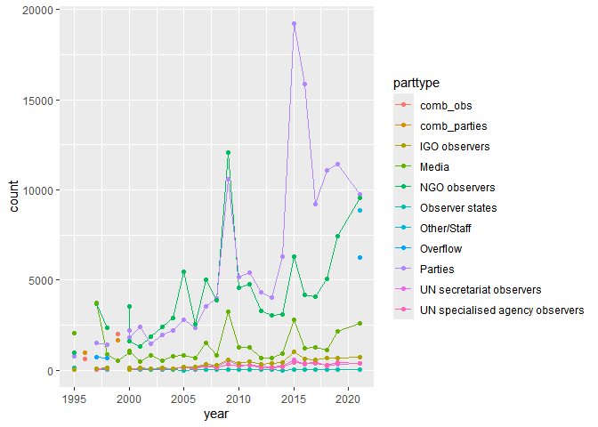<!-- -->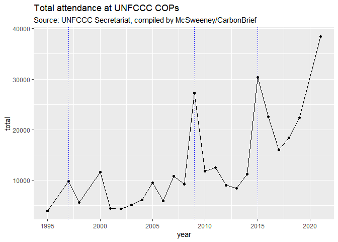<!-- -->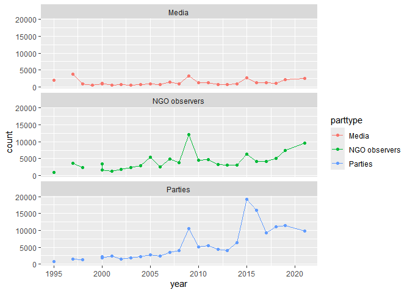<!-- -->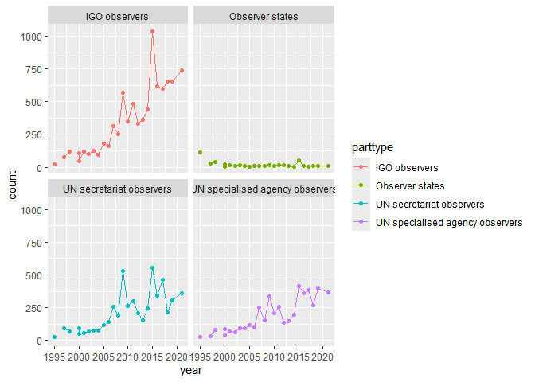<!-- -->

Notar que plotar por ano tem problema de duas COPs em 2000. depois fazer uma variavel mais refinada de data pro ponto de novembro ficar levemente mais pra frente
Talvez valha fazer linhas marcando Kyoto, Copenhagen e Paris (Cops de acordo)


Interessante ver que as tendências diferem. A participação da mídia é relativamente estável no tempo - aumento é só nas COPs de acordo (KP, Copenhagen, Paris). As demais subiram, mas a de ONGs é bem contida - cresce muito em Copenhagen, depois estável e só volta a crescer mais recente, pós Paris. No *Quo Vadis COP?* a explicação é que o secretariado conteve os registros de ONGs após os problemas em Copenhagen, não acompanhou a demanda. Nas partes, vemos também o efeito das COPs 15 e 21 (kyoto não), mas é muito clara a tendência descendo e estabilizando depois, mais baixa que no pico mas em novo patamar.

### Comparando com dados do Brasil


```
## Warning: Removed 4 rows containing missing values or values outside the scale range
## (`geom_point()`).
```

<!-- -->

Vemos que a trajetória de participação no Brasil segue o ritmo geral observado na UNFCCC como um todo, mas tem algumas especificidades tanto em relação às partes como aos observadores não-estatais. 
Os picos nas Partes se dão em 2009 e 2015, com queda em seguida. Período 2010 a 2014 é baixo e relativamente estável. Pós 2015, um novo patamar, mais alto.
Os picos nos observadores não-estatais se dão em 2009 e, em menor grau, em 2005 e 2015. Entre 2010 e 2015 o número é relativamente estável, mas dali em diante começa a crescer.
No Brasil, há também pico em 2009, mas a delegação segue grande em 2010 e 2011 (queda é muito mais lenta). Não há pico em Paris (provavelmente pela questão do party overflow) e se mantém relativamente estável depois. Há também um pico prévio em 2004, o que é interessante porque não ocorre nos demais.

Vejamos agora se separando a delegação governamental e a delegação não-governamental do Brasil os movimentos seguem algum outro padrão.

```
## Joining with `by = join_by(conf)`
## `summarise()` has grouped output by 'conf'. You can override using the
## `.groups` argument.
## Joining with `by = join_by(conf)`
## `summarise()` has grouped output by 'conf'. You can override using the
## `.groups` argument.
## Joining with `by = join_by(conf)`
## `summarise()` has grouped output by 'conf'. You can override using the
## `.groups` argument.
```


``` r
attbrgeral %>% filter(parttype %in% c("Parties", "Brazil government")) %>% 
  ggplot(aes(x=year, y = count, color = parttype)) +
  geom_line() + geom_point() +
  facet_wrap(~parttype, ncol = 1, scales = 'free_y') +
  labs(title = "Participação na UNFCCC", 
       subtitle = "Escalas distintas no eixo y") +
  theme(legend.title=element_blank())
```

```
## Warning: Removed 2 rows containing missing values or values outside the scale range
## (`geom_point()`).
```

<!-- -->

``` r
attbrgeral %>% filter(parttype %in% c("Parties",
                                      "Brazil government (expanded)")) %>% 
  ggplot(aes(x=year, y = count, color = parttype)) +
  geom_line() + geom_point() +
  facet_wrap(~parttype, ncol = 1, scales = 'free_y') +
  labs(title = "Participação na UNFCCC", 
       subtitle = "Escalas distintas no eixo y") +
  theme(legend.title=element_blank())
```

```
## Warning: Removed 2 rows containing missing values or values outside the scale range
## (`geom_point()`).
```

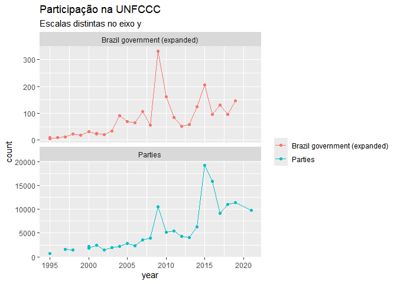<!-- -->

``` r
attbrgeral %>% filter(parttype %in% c("NGO observers", 
                                      "Brazil non-government")) %>% 
  ggplot(aes(x=year, y = count, color = parttype)) +
  geom_line() + geom_point() +
  geom_vline(xintercept = 2015, linetype = 'dotted', color = 'red') +
  facet_wrap(~parttype, ncol = 1, scales = 'free_y') +
  labs(title = "Participação na UNFCCC", 
       subtitle = "Escalas distintas no eixo y") +
  theme(legend.title=element_blank())
```

```
## Warning: Removed 2 rows containing missing values or values outside the scale range
## (`geom_point()`).
```

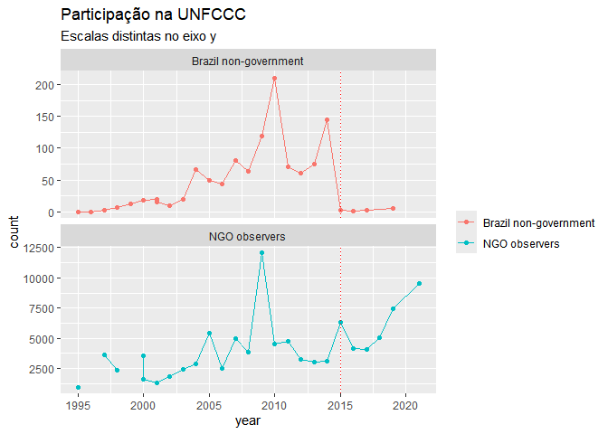<!-- -->


### Ainda a fazer
- Adicionar os dados da COP27. O banco já me dá os dados da lista provisória, mas posso pegar manualmente os dados corretos.
- Raspar os dados da página de participação da ONU para ter um gráfico com os anos faltantes (96 e 99), mas usando os dados de Total estados e total não gov. Esses dados também dão, para os anos mais recentes, uma ideia do gap de demanda vs participação das ONGs e do tamanho das constituencies de ONGs hoje.


## Comparação do tamanho das delegações de países

Aqui, os dados vem de Kaya & Schofield (2020).
Preciso checar certinho se os dados incluem, de fato, toda a delegação ou só os representantes governamentais/algum outro tipo de filtro. Passando rápido elo texto, parecia que incluía tudo, mas é bom ver com calma, numa leitura mais detido.
**Me chamou muita atenção a delegação brasileira pra Varsóvia (COP 19, 2013) aparecer só com 42 pessoas - o que só pode ser um erro. É preciso checar, entender o que aconteceu e arrumar se for o caso.**

### Importando a base


``` r
delegsize <- read.csv(here::here("dbs","Schofield", "ClimateChangeAttendanceFPA.csv"))
```


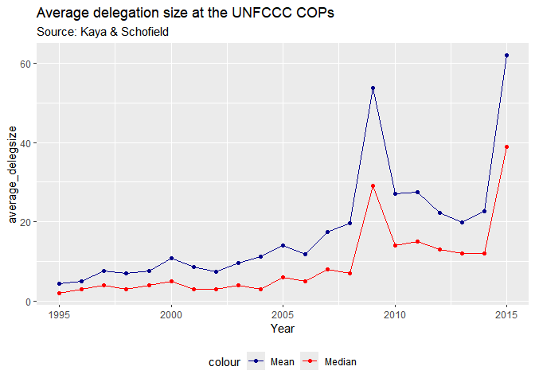<!-- -->

<!-- -->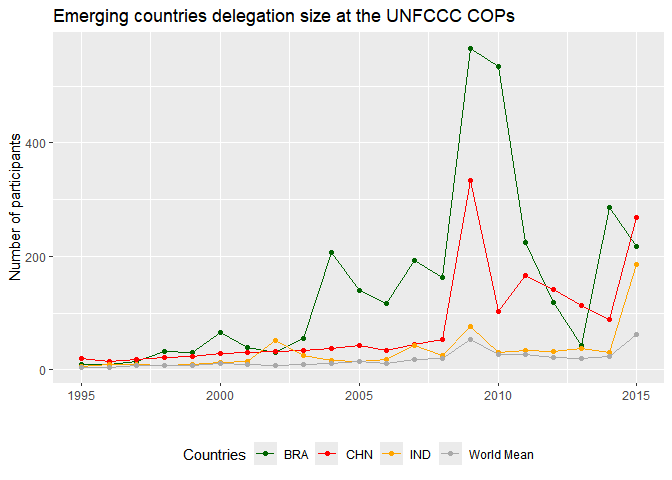<!-- -->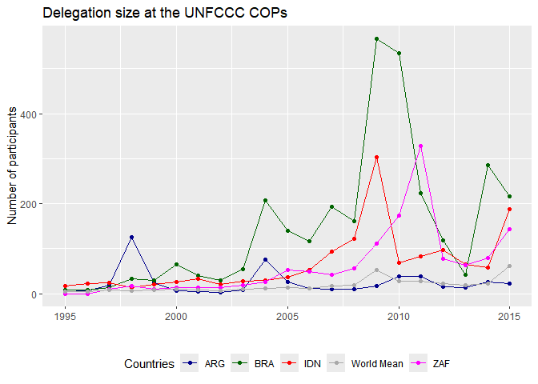<!-- -->

### Ainda a fazer
- calcular e plotar médias de grupos de países (categorias de renda, anexo 1 vs nao anexo 1). pra Annex1 já tem uma dummy e a base tem outras variáveis disponíveis tb, mas categoria de renda do Banco Mundial teria que pegar.

- incluir linhas dividindo momentos importantes pra conferencia (kyoto, copengagen, paris)

- conferir a diferença entre a minha base de deleg size e a deles (a minha elimina alguns participantes duplicados, provavelmente)

- pensar outros países que possam ser interessantes. talvez fosse possível criar algum tipo de grupo de países semelhantes (como se faz com controle sintético)

- **Me chamou muita atenção a delegação brasileira pra Varsóvia (COP 19, 2013) aparecer só com 42 pessoas - o que só pode ser um erro. É preciso checar, entender o que aconteceu e arrumar se for o caso.** Infelizmente, isso é um problema porque afeta minha confiança nos dados deles. Mas são os dados que temos, então vai acabar indo por aí.

# COMPOSIÇÃO DAS DELEGAÇÕES

Aqui uso os dados de Skovgaard e Gallant, os quais são, por sua vez, expansão de Schroeder et al. O número de eventos e países é bem reduzido, mas cobre diferentes períodos da convenção.


Comparemos agora o Brasil e outros países

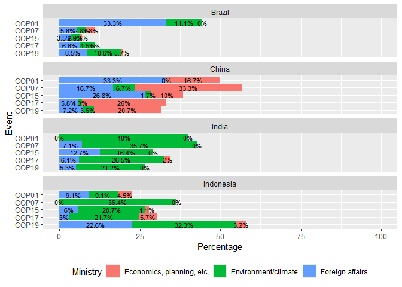<!-- -->


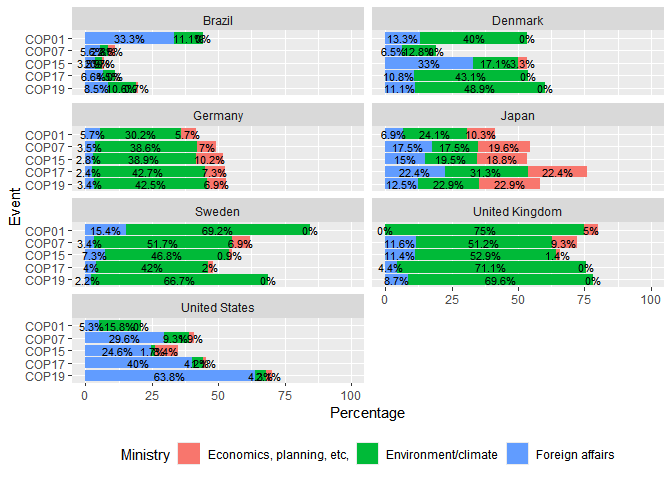<!-- -->


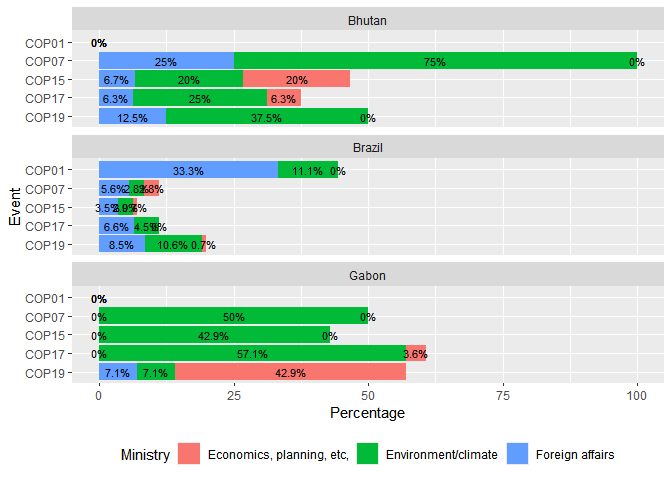<!-- -->


# VISIBILIDADE DO TEMA NO MUNDO
## Cobertura midiática sobre clima - dados do MeCCO

Os dados aqui são do Media and Climate Change Observatory (MeCCO), coordenado pela Universidade de Colorado. Monitoram 131 jornais em 59 países em 7 regiões do mundo. Dados cobrem 2004 até 2023, mês a mês.

Nesse relatório, estou usando a atualização cobrindo **outubro de 2023 (2023-11-27)**

### Importação da base

```
## Warning: There was 1 warning in `mutate()`.
## ℹ In argument: `value = as.numeric(values)`.
## Caused by warning:
## ! NAs introduzidos por coerção
```


```
## Warning: Removed 16 rows containing missing values or values outside the scale range
## (`geom_line()`).
```

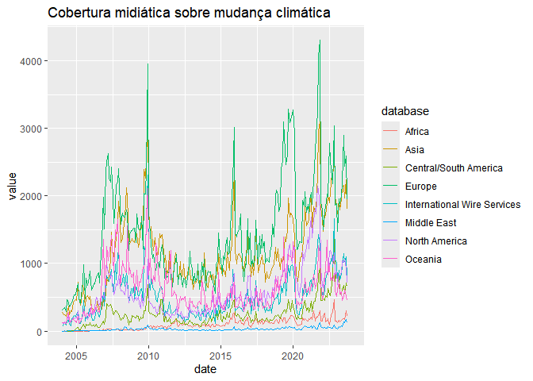<!-- -->

```
## Warning: Removed 2 rows containing missing values or values outside the scale range
## (`geom_line()`).
```

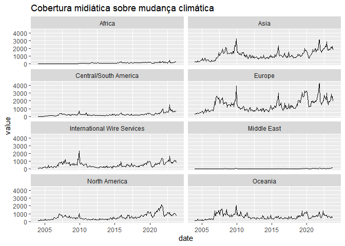<!-- -->

```
## Warning: Removed 2 rows containing missing values or values outside the scale range
## (`geom_line()`).
```

<!-- -->


```
## Warning: Removed 28 rows containing missing values or values outside the scale range
## (`geom_line()`).
```

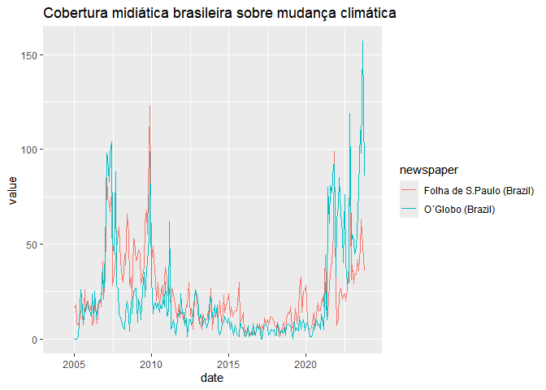<!-- -->

```
## Warning: Removed 14 rows containing missing values or values outside the scale range
## (`geom_line()`).
```

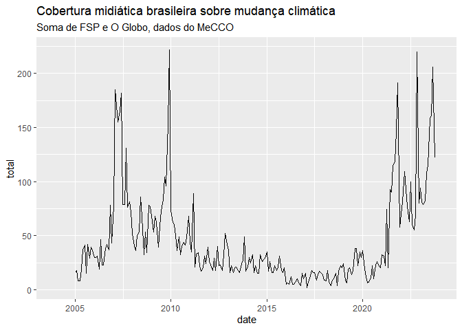<!-- -->


``` r
left_join(
  media_data %>% group_by(date) %>% summarise(mundo = sum(value)),
  br_media_data %>% group_by(date) %>% summarise(brasil = sum(value))
  ) %>% 
  pivot_longer(cols = c(2,3), names_to = "unit", values_to = "total") %>% 
  ggplot(aes(x=date, y=total, color = unit)) +
  geom_line() +
  labs(title = "Comparação da cobertura midiática sobre clima no Brasil e no mundo") +
  scale_x_date(date_breaks = "2 years", date_labels = "%b %Y")
```

```
## Joining with `by = join_by(date)`
```

```
## Warning: Removed 16 rows containing missing values or values outside the scale range
## (`geom_line()`).
```

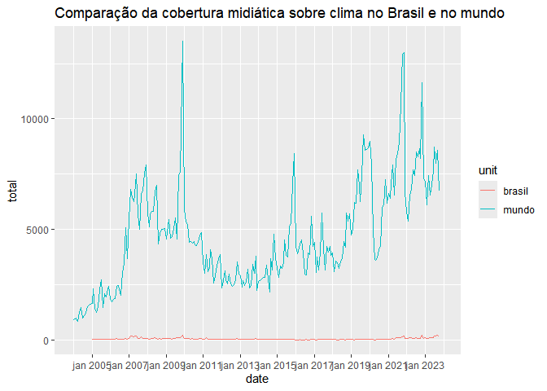<!-- -->

``` r
left_join(
  media_data %>% group_by(date) %>% summarise(mundo = sum(value)),
  br_media_data %>% group_by(date) %>% summarise(brasil = sum(value))
  ) %>% 
  pivot_longer(cols = c(2,3), names_to = "unit", values_to = "total") %>% 
  ggplot(aes(x=date, y=total, color = unit)) +
  geom_line() +
  facet_wrap(~unit, ncol = 1, scales = "free") +
  labs(title = "Comparação da cobertura midiática sobre clima no Brasil e no mundo", subtitle = "Escalas distintas para melhor comparação da evolução temporal") +
  scale_x_date(date_breaks = "2 years", date_labels = "%b %Y")
```

```
## Joining with `by = join_by(date)`
```

```
## Warning: Removed 16 rows containing missing values or values outside the scale range
## (`geom_line()`).
```

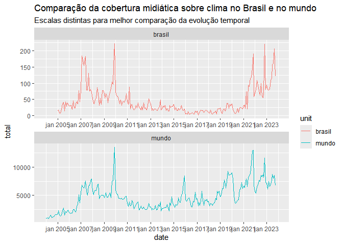<!-- -->

Como é de se esperar, a cobertura midiática de clima no Brasil (2 jornais na amostra) representa uma parcela ínfima da cobertura no mundo (131 na amostra (*checar se for o caso - talvez seja menos, porque sao só os jornais e esse numero pode cobrir tv etc*)). 
A diferença de escalas, porém, não nos impede de observar que a tendência da cobertura no Brasil segue, em vários momentos, a mesma tendência da observada no mundo. Há, porém, momentos de diferença importante: 
- em 2007, quando sobe no mundo, segue com cobertura; no Brasil, cai novamente. 
- em 2015, na época de Paris, há um pico de cobertura no mundo; no Brasil, nada acontece - e até diminui em seguida.
- de 2018 para frente, a cobertura no mundo começa a subir muito (cai em jan 2020) e aumenta ciclicamente, mas mantendo-se em um novo patamar. No Brasil, o crescimento de 2018 praticamente não ocorre, mantendo-se estável em uma cobertura baixa. É só em 2021 que a cobertura brasileira volta a subir, acompanhando agora as tendências (cíclicas) da mídia no mundo.


### Ainda a fazer

- verificar se dinâmica de participação no Brasil parece responder mais à cobertura internacional ou à cobertura nacional/regional (**cruzar os dados**)

- fora do relatório, na discussão dos dados: pensar o que está acontecendo nos momentos em que cobertura Brasil difere da internacional e o que isso significa. Em 2015-6, sei que temos o ciclo do impeachment. E nos demais? Qual é a relevância disso pra agenda de clima? O que estava acontecendo em termos de policy?

- para melhorar as figuras: talvez seja interessante marcar os grandes eventos com linhas (e.g. Copenhagen, Paris, se tiver algum desastre ou coisas do IPCC); talvez seja interessante botar as marcaçoes do eixo em novembro, quando ocorre a COP - isso ajuda a ter uma noção mais certa do interesse se for juntar com participação e parece uma boa saída pra equilibrar a sazonalidade da cobertura.


# AGENDA DA UNFCCC
Os dados dessa seção são tomados de Allan & Bhandary. 
Raspei os dados do Tableau desse site: https://www.bu.edu/gdp/climate-negotiations-database/

A raspagem foi feita em 30/11/2023
Consta no site:
Data updated: Nov 1, 2023
When citing this page: Bhandary, R.R., Pitts, J. 2023. "Climate Negotiations Database" Global Policy Development Center, Boston University

## Volume de subtemas na agenda
Allan e Bhandary compilaram o número de subitens presente nas agendas, dividindo por órgão da convenção


O gráfico abaixo mostra o volume total por ano, somando os vários órgãos da convenção
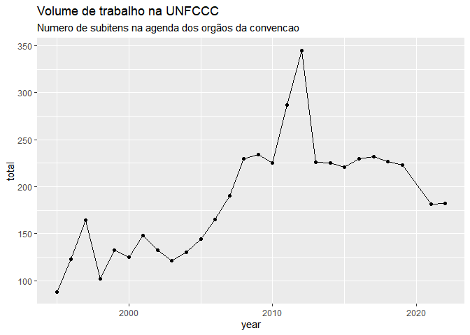<!-- -->


```
## Warning: Removed 2 rows containing missing values or values outside the scale range
## (`geom_point()`).
```

<!-- -->

### Ainda a fazer
- Dados da agenda separados por tema (esp alguns temas especificos)
- Replicação da figura do tableau (como conversa mudou)
- Cruzar com dados de deleg (total attendance e deleg brasil)
- Cruzar dados de agenda especifica com orgaos especificos brasil (mma com florestas etc)
