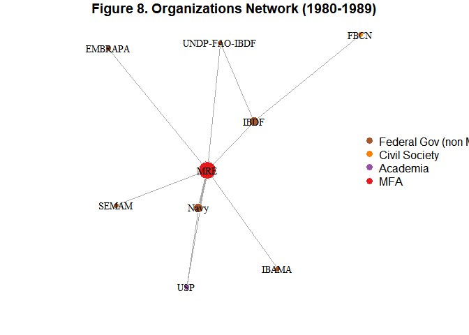

# A fazer no relatório
- teste de centralidade com ONGs?
- comparação de nós centrais brokers/bridging capital vs closeness/bonding capital

# Preparo dos dados

## Versão do banco
Relatório mais recente: "2025-06-09"


**Versão da planilha deleg**: 2023-12-20

**Versão da planilha orgs**: 2023-12-20

**Versão da planilha class**: 2022-06-29

**Versão da planilha eventos**: 2023-12-14

**Versão da planilha individuos**: 2023-12-21


## ORGANIZATIONS COLLAPSED NETWORK
We need to transform the ind-year network into org net. While this represents an inevitable loss of information, it should also help in interpreting and discerning structures.

At this point of the research, we are not interested in a full picture of organizations (ie, covering the whole period). We will first filter the period of interest, then collapse to orgs. This should avoid some problems (e.g. allowing us to properly filter
by org info such as n of events attended on that period, not complete database)


# Visualizando e calculando centralidade em diferentes recortes de período

## Preparando p/ visualização

As there are too many categories of organization in total (24), we will use the simplified categorization (10). This allows us to better compare across figures.

Segue a lista usada: "Other","Business","Federal Gov (non MFA)", "Subnational", "Civil Society", "Academia", "Parliament", "Not identified", "MFA"


Criamos uma função para preparar os vértices pra visualização. Calcula-se a centralidade do nó (só aparece nome da org se alta centralidade); Atribui-se o peso às arestas (invertido, porque igraph trabalha com lógica de peso como custo e queremos peso como força)


## Colapsando vértices para melhorar visualização e estatísticas
Como o banco de dados foi criado com múltiplos propósitos, as organizações foram classificadas de forma a manter o máximo de distinções entre elas. Assim, órgãos que passam por reformas e mudam de nome muitas vezes são classificados como novas organizações. Como consequência, perdemos algumas informações importantes para avaliar a centralidade das organizações ambientais, que passaram por múltiplas reformas ao longo do tempo (e.g., SEMA, SEMAM-PR, MMA). Em outros casos, podemos ter uma distinção importante para pensar questões administrativas, mas que é pouco relevante para pensar a participação de determinado grupo nas delegações (e.g., Ministério da Marinha vs Marinha do Brasil é pouco relevante para pensar se militares estão presentes ou não).

Para resolver esse problema, podemos colapsar alguns vértices (ie, fundir as organizações), de modo a obter dados mais coerentes com nossos objetivos nessa etapa da pesquisa.


**Checar os relatórios sobre deleg e ver quais foram os órgãos escolhidos para serem colapsados na análise**. No script de redes, colapsei a Marinha (nos anos 70)


## Redes filtradas por mandato presidencial

### Ditadura (1970-1984)


<!-- -->


### Sarney (85-89)


<!-- -->


### Collor-Itamar (90-94)
86 orgs. Quase tudo deve ser Rio92, aí fica meio zoneado. Para esse período, juntamos os Ministérios com as Secretarias que os originaram: SCT->MCT, SEMAM -> MMA


```
## Joining with `by = join_by(long)`
```

<!-- -->


### FHC1 (95-98)

Aqui apresento na visualização a rede completa (0+ participações)


```
## Joining with `by = join_by(long)`
```

<!-- -->


### FHC2 (99-02)

Para a visualização, só apresento a rede com organizações que participaram ao menos duas vezes de eventos no período. (A inclusão de 1 ou mais fica muito poluída, vai de 119 para 58). Sempre que uso visualização de rede filtrada, as centralidades são recalculadas para cada rede.


```
## Joining with `by = join_by(tipo_org_reduzido)`
## Joining with `by = join_by(long)`
```

<!-- -->


### Lula 1 (2003-2006)

Agora usamos o corte de 5+ participações (de 143 a 30)


```
## Joining with `by = join_by(tipo_org_reduzido)`
## Joining with `by = join_by(long)`
```

<!-- -->


### Lula 2 (2007-2010)
Filtro 5+: 267 orgs -> 71. Mudei o tamanho dos vértices (3 + 8*betw). Mudei os parâmetros da visualização p/ espaçar melhor


<!-- -->


### Dilma 1 (2011-2014)
463 orgs -> filtro 5+ = 121 orgs
as empresas estranhas foram colocadas com label pela posição interessante na rede (mov emp pela biodiversidade; GT pecuaria sustentavel). Mudei o tamanho dos vértices (3 + betw*8) e parametros da visualização p/ espaçar melhor


```
## Joining with `by = join_by(tipo_org_reduzido)`
## Joining with `by = join_by(long)`
```

<!-- -->


### Dilma/Temer (2015-2018)

128 orgs no geral. Filtro de 3+ = 54.


```
## Joining with `by = join_by(tipo_org_reduzido)`
## Joining with `by = join_by(long)`
```

<!-- -->


### Visualização das estatísticas por mandato presidencial
(Betweenness, normalized and inverted weights)
<!-- -->

(Eigenvector, normalized and inverted weights)
<!-- -->

### Tabela das estatísticas por mandato presidencial


Table: Betweenness centrality

|mandato      |org                                                 |     value|
|:------------|:---------------------------------------------------|---------:|
|ditadura     |Ministério das Relações Exteriores                  | 0.9743590|
|ditadura     |Ministério da Agricultura, Pecuária e Abastecimento | 0.0000000|
|ditadura     |Average                                             | 0.0474664|
|sarney       |Ministério das Relações Exteriores                  | 0.9523810|
|sarney       |Average                                             | 0.1547619|
|colloritamar |Ministério das Relações Exteriores                  | 0.9989715|
|colloritamar |Ministério da Ciência e Tecnologia                  | 0.0000000|
|colloritamar |Ministério do Meio Ambiente                         | 0.0000000|
|colloritamar |Ministério da Agricultura, Pecuária e Abastecimento | 0.0000000|
|colloritamar |Average                                             | 0.0118943|
|fhc1         |Ministério das Relações Exteriores                  | 0.8165025|
|fhc1         |Ministério do Meio Ambiente                         | 0.2253695|
|fhc1         |Ministério da Ciência e Tecnologia                  | 0.2672414|
|fhc1         |Ministério da Agricultura, Pecuária e Abastecimento | 0.0000000|
|fhc1         |Average                                             | 0.0459360|
|fhc2         |Ministério das Relações Exteriores                  | 0.5148486|
|fhc2         |Ministério da Agricultura, Pecuária e Abastecimento | 0.0000000|
|fhc2         |Ministério da Ciência e Tecnologia                  | 0.4834130|
|fhc2         |Ministério do Meio Ambiente                         | 0.1474721|
|fhc2         |Average                                             | 0.0171251|
|lula1        |Ministério do Meio Ambiente                         | 0.8956148|
|lula1        |Ministério da Agricultura, Pecuária e Abastecimento | 0.0000000|
|lula1        |Ministério das Relações Exteriores                  | 0.0101388|
|lula1        |Ministério da Ciência e Tecnologia                  | 0.3419239|
|lula1        |Average                                             | 0.0089196|
|lula2        |Ministério do Meio Ambiente                         | 0.1040289|
|lula2        |Ministério das Relações Exteriores                  | 0.9392680|
|lula2        |Ministério da Agricultura, Pecuária e Abastecimento | 0.0000000|
|lula2        |Ministério da Ciência e Tecnologia                  | 0.0007377|
|lula2        |Average                                             | 0.0055873|
|dilma1       |Ministério das Relações Exteriores                  | 0.3562883|
|dilma1       |Ministério do Meio Ambiente                         | 0.0302044|
|dilma1       |Ministério da Agricultura, Pecuária e Abastecimento | 0.0000000|
|dilma1       |Ministério da Ciência e Tecnologia                  | 0.0000000|
|dilma1       |Average                                             | 0.0028916|
|dilmatemer   |Ministério do Meio Ambiente                         | 0.8411449|
|dilmatemer   |Ministério das Relações Exteriores                  | 0.5856768|
|dilmatemer   |Ministério da Agricultura, Pecuária e Abastecimento | 0.0000000|
|dilmatemer   |Ministério da Ciência e Tecnologia                  | 0.0000000|
|dilmatemer   |Average                                             | 0.0111470|


Table: Eigenvector centrality

|mandato      |org                                                 |     value|
|:------------|:---------------------------------------------------|---------:|
|ditadura     |Ministério das Relações Exteriores                  | 0.0813241|
|ditadura     |Ministério da Agricultura, Pecuária e Abastecimento | 1.0000000|
|ditadura     |Average                                             | 0.4658826|
|sarney       |Ministério das Relações Exteriores                  | 0.8908417|
|sarney       |Average                                             | 0.5460832|
|colloritamar |Ministério das Relações Exteriores                  | 0.0297123|
|colloritamar |Ministério da Ciência e Tecnologia                  | 0.2495516|
|colloritamar |Ministério do Meio Ambiente                         | 0.2525804|
|colloritamar |Ministério da Agricultura, Pecuária e Abastecimento | 1.0000000|
|colloritamar |Average                                             | 0.7730075|
|fhc1         |Ministério das Relações Exteriores                  | 0.1863688|
|fhc1         |Ministério do Meio Ambiente                         | 0.2826204|
|fhc1         |Ministério da Ciência e Tecnologia                  | 0.1540312|
|fhc1         |Ministério da Agricultura, Pecuária e Abastecimento | 0.1063167|
|fhc1         |Average                                             | 0.3694242|
|fhc2         |Ministério das Relações Exteriores                  | 0.0438076|
|fhc2         |Ministério da Agricultura, Pecuária e Abastecimento | 0.0316312|
|fhc2         |Ministério da Ciência e Tecnologia                  | 0.3082772|
|fhc2         |Ministério do Meio Ambiente                         | 0.0904640|
|fhc2         |Average                                             | 0.4082970|
|lula1        |Ministério do Meio Ambiente                         | 0.0790120|
|lula1        |Ministério da Agricultura, Pecuária e Abastecimento | 0.7887019|
|lula1        |Ministério das Relações Exteriores                  | 0.1315009|
|lula1        |Ministério da Ciência e Tecnologia                  | 0.1169314|
|lula1        |Average                                             | 0.4353669|
|lula2        |Ministério do Meio Ambiente                         | 0.1289914|
|lula2        |Ministério das Relações Exteriores                  | 0.0401210|
|lula2        |Ministério da Agricultura, Pecuária e Abastecimento | 0.8329987|
|lula2        |Ministério da Ciência e Tecnologia                  | 0.1164531|
|lula2        |Average                                             | 0.4310379|
|dilma1       |Ministério das Relações Exteriores                  | 0.0175301|
|dilma1       |Ministério do Meio Ambiente                         | 0.0220887|
|dilma1       |Ministério da Agricultura, Pecuária e Abastecimento | 0.1670038|
|dilma1       |Ministério da Ciência e Tecnologia                  | 0.1260479|
|dilma1       |Average                                             | 0.4921910|
|dilmatemer   |Ministério do Meio Ambiente                         | 0.0601606|
|dilmatemer   |Ministério das Relações Exteriores                  | 0.0990316|
|dilmatemer   |Ministério da Agricultura, Pecuária e Abastecimento | 0.1186306|
|dilmatemer   |Ministério da Ciência e Tecnologia                  | 0.3176544|
|dilmatemer   |Average                                             | 0.4020743|

## Redes filtradas por década
Outra forma de separar os dados é filtrar as redes por décadas.
Aqui, para permitir a comparabilidade no tempo, seria interessante colapsar, no futuro, MMA com outras organizações antecessoras.

Na visualização da rede, estamos usando o algoritmo Fruchterman-Reingold (na implementação do pacote qgraph, feita por meio do pacote multienrichjam - não me lembro exatamente qual era a vantagem da implementação aqui, mas é algo relativo a ajustes como os nós não ficarem tão sobrepostos). O Fruchterman-Reingold é um dos algoritmos mais comuns em visualização de redes, assim como o Kawada-Kawai. No FR, o peso é um fator de atração (mais peso = maior atração, menos peso repele); no KK, a lógica é a inversa, como uma mola (mais peso = mais distância).

Os nomes das organizações aparecem cf conveniencia na visualização. São apresentados sempre os das X+ orgs em ranking de betweenness. Tamanho do vértice é proporcional à centralidade de intermediação (devidamente calculada com peso invertido para dar conta do conceito distinto na implementação igraph), usando a fórmula (5 + betweenn*10) (garante tamanho mínimo)


### Década de 1970
Due to the use of the database for a different purpose, the Ministry of the Navy was originally separated from the Navy as an organization. This is to allow for future ministerial changes (Ministry becomes the Ministry of Defense in the 00s which is not to be confused with the Navy itself). For our purposes, however, this separation does not make any sense. So we need to fuse these vertices.


```
## Joining with `by = join_by(long)`
```

<!-- -->


### Década de 1980


```
## Joining with `by = join_by(long)`
```

<!-- -->


### Década de 1990
Fizemos um collapse dos nós referentes a MMA-SEMAM e SCT-MCT.


```
## Joining with `by = join_by(long)`
```

<!-- -->

#### Filtragem da rede: apenas N+ participações
To clear up the graph and better look at the community structure, it might be more interesting to limit the organizations in the figure. Normally, this would be done by filtering vertex degree (n of connections). This would not be what we want, as someone who participates in only one COP or at UNCED might have a higher degree than someone at 10 smaller events. What we want, instead, is the number of event participations per org as the filter.

*3 ou mais participações da organização*

Idealmente, incluir os nomes das organizações de novo. Como a rede é induzida da rede anterior, já chega com nomes corrigidos (e apagados). Tem alguns que já estavam sem label. Rever código para ver como fazer isso. (É a função prepare nodes?)

```
## Joining with `by = join_by(tipo_org_reduzido)`
## Joining with `by = join_by(long)`
```

<!-- -->


### Década de 2000


<!-- -->

#### Filtragem da rede: apenas N+ participações
To clear up the graph and better look at the community structure, it might be more interesting to limit the organizations in the figure. Normally, this would be done by filtering vertex degree (n of connections). This would not be what we want, as someone who participates in only one COP or at UNCED might have a higher degree than someone at 10 smaller events. What we want, instead, is the number of event participations per org as the filter.

*10 ou mais participações da organização*


```
## Joining with `by = join_by(tipo_org_reduzido)`
## Joining with `by = join_by(long)`
```

<!-- -->


### Década de 2010


<!-- -->

#### Filtragem da rede: apenas N+ participações
To clear up the graph and better look at the community structure, it might be more interesting to limit the organizations in the figure. Normally, this would be done by filtering vertex degree (n of connections). This would not be what we want, as someone who participates in only one COP or at UNCED might have a higher degree than someone at 10 smaller events. What we want, instead, is the number of event participations per org as the filter.

*10 ou mais participações da organização*


```
## Joining with `by = join_by(tipo_org_reduzido)`
## Joining with `by = join_by(long)`
```

<!-- -->


```
## Joining with `by = join_by(tipo_org_reduzido)`
## Joining with `by = join_by(long)`
```

<!-- -->


## Visualização das estatísticas por década
(Betweenness, normalized and inverted weights)
<!-- -->

### Tabela das estatísticas por mandato presidencial

Table: Betweenness centrality

|decade |org                                                 |     value|
|:------|:---------------------------------------------------|---------:|
|70s    |Ministério das Relações Exteriores                  | 0.9784615|
|70s    |Ministério da Agricultura, Pecuária e Abastecimento | 0.0000000|
|70s    |Average                                             | 0.0431909|
|80s    |Ministério das Relações Exteriores                  | 0.9285714|
|80s    |Average                                             | 0.1587302|
|90s    |Ministério das Relações Exteriores                  | 0.9777270|
|90s    |Ministério da Ciência e Tecnologia                  | 0.0580621|
|90s    |Ministério do Meio Ambiente                         | 0.1687607|
|90s    |Ministério da Agricultura, Pecuária e Abastecimento | 0.0000000|
|90s    |Average                                             | 0.0119565|
|00s    |Ministério das Relações Exteriores                  | 0.5934200|
|00s    |Ministério da Agricultura, Pecuária e Abastecimento | 0.0000000|
|00s    |Ministério do Meio Ambiente                         | 0.4357058|
|00s    |Ministério da Ciência e Tecnologia                  | 0.2514728|
|00s    |Average                                             | 0.0066671|
|10s    |Ministério das Relações Exteriores                  | 0.5121289|
|10s    |Ministério do Meio Ambiente                         | 0.1466077|
|10s    |Ministério da Agricultura, Pecuária e Abastecimento | 0.0000000|
|10s    |Ministério da Ciência e Tecnologia                  | 0.0000000|
|10s    |Average                                             | 0.0027647|

## Estatísticas da rede em janelas móveis de 4 anos
Observar a rede ano-a-ano é problemático, porque há muitos eventos que são bianuais e a rede variaria muito de ano a ano. Ter um valor de centralidade para cada ano, porém, viabiliza uma série de análises.
Para calcular a centralidade de modo a construir valores para cada ano, uma alternativa é montar janelas móveis para as redes. Isto é, para cada ano, veríamos a centralidade na rede formada pelos eventos daquele ano + os eventos de até N anos atrás (Note-se que, como mínimo e máximo são incluídos, temos N+1 anos na rede). Isso permite incorporar, também, a ideia de que os laços estabelecidos em eventos anteriores também 'se perdem' se não são renovados ao longo do tempo.

Para calcular a centralidade com as janelas móveis, usaremos as funções definidas anteriormente (filtro de rede por ano e cálculo da centralidade). Ao invés de incluir os dados manualmente, porém, vamos aplicá-los a partir de uma função.


### Centralidade de intermediação (betweenness)

#### Visualização de betweenness
<!-- -->


``` r
full_centr2 <- map_df(1973:2018, calcularcent_janela, tamanho_janela = 2)
```

```
## [1] "id_indevento"
## [1] "id_individuo"
## [1] "id_evento"
## [1] "nome_padrao"
## [1] "ano_part"
```

```
## Joining with `by = join_by(name)`
```

```
## [1] "id_indevento"
## [1] "id_individuo"
## [1] "id_evento"
## [1] "nome_padrao"
## [1] "ano_part"
```

```
## Joining with `by = join_by(name)`
```

```
## [1] "id_indevento"
## [1] "id_individuo"
## [1] "id_evento"
## [1] "nome_padrao"
## [1] "ano_part"
```

```
## Joining with `by = join_by(name)`
```

```
## [1] "id_indevento"
## [1] "id_individuo"
## [1] "id_evento"
## [1] "nome_padrao"
## [1] "ano_part"
```

```
## Joining with `by = join_by(name)`
```

```
## [1] "id_indevento"
## [1] "id_individuo"
## [1] "id_evento"
## [1] "nome_padrao"
## [1] "ano_part"
```

```
## Joining with `by = join_by(name)`
```

```
## [1] "id_indevento"
## [1] "id_individuo"
## [1] "id_evento"
## [1] "nome_padrao"
## [1] "ano_part"
```

```
## Joining with `by = join_by(name)`
```

```
## [1] "id_indevento"
## [1] "id_individuo"
## [1] "id_evento"
## [1] "nome_padrao"
## [1] "ano_part"
```

```
## Joining with `by = join_by(name)`
```

```
## [1] "id_indevento"
## [1] "id_individuo"
## [1] "id_evento"
## [1] "nome_padrao"
## [1] "ano_part"
```

```
## Joining with `by = join_by(name)`
```

```
## [1] "id_indevento"
## [1] "id_individuo"
## [1] "id_evento"
## [1] "nome_padrao"
## [1] "ano_part"
```

```
## Joining with `by = join_by(name)`
```

```
## [1] "id_indevento"
## [1] "id_individuo"
## [1] "id_evento"
## [1] "nome_padrao"
## [1] "ano_part"
```

```
## Joining with `by = join_by(name)`
```

```
## [1] "id_indevento"
## [1] "id_individuo"
## [1] "id_evento"
## [1] "nome_padrao"
## [1] "ano_part"
```

```
## Joining with `by = join_by(name)`
```

```
## [1] "id_indevento"
## [1] "id_individuo"
## [1] "id_evento"
## [1] "nome_padrao"
## [1] "ano_part"
```

```
## Joining with `by = join_by(name)`
```

```
## [1] "id_indevento"
## [1] "id_individuo"
## [1] "id_evento"
## [1] "nome_padrao"
## [1] "ano_part"
```

```
## Joining with `by = join_by(name)`
```

```
## [1] "id_indevento"
## [1] "id_individuo"
## [1] "id_evento"
## [1] "nome_padrao"
## [1] "ano_part"
```

```
## Joining with `by = join_by(name)`
```

```
## [1] "id_indevento"
## [1] "id_individuo"
## [1] "id_evento"
## [1] "nome_padrao"
## [1] "ano_part"
```

```
## Joining with `by = join_by(name)`
```

```
## [1] "id_indevento"
## [1] "id_individuo"
## [1] "id_evento"
## [1] "nome_padrao"
## [1] "ano_part"
```

```
## Joining with `by = join_by(name)`
```

```
## [1] "id_indevento"
## [1] "id_individuo"
## [1] "id_evento"
## [1] "nome_padrao"
## [1] "ano_part"
```

```
## Joining with `by = join_by(name)`
```

```
## [1] "id_indevento"
## [1] "id_individuo"
## [1] "id_evento"
## [1] "nome_padrao"
## [1] "ano_part"
```

```
## Joining with `by = join_by(name)`
```

```
## [1] "id_indevento"
## [1] "id_individuo"
## [1] "id_evento"
## [1] "nome_padrao"
## [1] "ano_part"
```

```
## Joining with `by = join_by(name)`
```

```
## [1] "id_indevento"
## [1] "id_individuo"
## [1] "id_evento"
## [1] "nome_padrao"
## [1] "ano_part"
```

```
## Joining with `by = join_by(name)`
```

```
## [1] "id_indevento"
## [1] "id_individuo"
## [1] "id_evento"
## [1] "nome_padrao"
## [1] "ano_part"
```

```
## Joining with `by = join_by(name)`
```

```
## [1] "id_indevento"
## [1] "id_individuo"
## [1] "id_evento"
## [1] "nome_padrao"
## [1] "ano_part"
```

```
## Joining with `by = join_by(name)`
```

```
## [1] "id_indevento"
## [1] "id_individuo"
## [1] "id_evento"
## [1] "nome_padrao"
## [1] "ano_part"
```

```
## Joining with `by = join_by(name)`
```

```
## [1] "id_indevento"
## [1] "id_individuo"
## [1] "id_evento"
## [1] "nome_padrao"
## [1] "ano_part"
```

```
## Joining with `by = join_by(name)`
```

```
## [1] "id_indevento"
## [1] "id_individuo"
## [1] "id_evento"
## [1] "nome_padrao"
## [1] "ano_part"
```

```
## Joining with `by = join_by(name)`
```

```
## [1] "id_indevento"
## [1] "id_individuo"
## [1] "id_evento"
## [1] "nome_padrao"
## [1] "ano_part"
```

```
## Joining with `by = join_by(name)`
```

```
## [1] "id_indevento"
## [1] "id_individuo"
## [1] "id_evento"
## [1] "nome_padrao"
## [1] "ano_part"
```

```
## Joining with `by = join_by(name)`
```

```
## [1] "id_indevento"
## [1] "id_individuo"
## [1] "id_evento"
## [1] "nome_padrao"
## [1] "ano_part"
```

```
## Joining with `by = join_by(name)`
```

```
## [1] "id_indevento"
## [1] "id_individuo"
## [1] "id_evento"
## [1] "nome_padrao"
## [1] "ano_part"
```

```
## Joining with `by = join_by(name)`
```

```
## [1] "id_indevento"
## [1] "id_individuo"
## [1] "id_evento"
## [1] "nome_padrao"
## [1] "ano_part"
```

```
## Joining with `by = join_by(name)`
```

```
## [1] "id_indevento"
## [1] "id_individuo"
## [1] "id_evento"
## [1] "nome_padrao"
## [1] "ano_part"
```

```
## Joining with `by = join_by(name)`
```

```
## [1] "id_indevento"
## [1] "id_individuo"
## [1] "id_evento"
## [1] "nome_padrao"
## [1] "ano_part"
```

```
## Joining with `by = join_by(name)`
```

```
## [1] "id_indevento"
## [1] "id_individuo"
## [1] "id_evento"
## [1] "nome_padrao"
## [1] "ano_part"
```

```
## Joining with `by = join_by(name)`
```

```
## [1] "id_indevento"
## [1] "id_individuo"
## [1] "id_evento"
## [1] "nome_padrao"
## [1] "ano_part"
```

```
## Joining with `by = join_by(name)`
```

```
## [1] "id_indevento"
## [1] "id_individuo"
## [1] "id_evento"
## [1] "nome_padrao"
## [1] "ano_part"
```

```
## Joining with `by = join_by(name)`
```

```
## [1] "id_indevento"
## [1] "id_individuo"
## [1] "id_evento"
## [1] "nome_padrao"
## [1] "ano_part"
```

```
## Joining with `by = join_by(name)`
```

```
## [1] "id_indevento"
## [1] "id_individuo"
## [1] "id_evento"
## [1] "nome_padrao"
## [1] "ano_part"
```

```
## Joining with `by = join_by(name)`
```

```
## [1] "id_indevento"
## [1] "id_individuo"
## [1] "id_evento"
## [1] "nome_padrao"
## [1] "ano_part"
```

```
## Joining with `by = join_by(name)`
```

```
## [1] "id_indevento"
## [1] "id_individuo"
## [1] "id_evento"
## [1] "nome_padrao"
## [1] "ano_part"
```

```
## Joining with `by = join_by(name)`
```

```
## [1] "id_indevento"
## [1] "id_individuo"
## [1] "id_evento"
## [1] "nome_padrao"
## [1] "ano_part"
```

```
## Joining with `by = join_by(name)`
```

```
## [1] "id_indevento"
## [1] "id_individuo"
## [1] "id_evento"
## [1] "nome_padrao"
## [1] "ano_part"
```

```
## Joining with `by = join_by(name)`
```

```
## [1] "id_indevento"
## [1] "id_individuo"
## [1] "id_evento"
## [1] "nome_padrao"
## [1] "ano_part"
```

```
## Joining with `by = join_by(name)`
```

```
## [1] "id_indevento"
## [1] "id_individuo"
## [1] "id_evento"
## [1] "nome_padrao"
## [1] "ano_part"
```

```
## Joining with `by = join_by(name)`
```

```
## [1] "id_indevento"
## [1] "id_individuo"
## [1] "id_evento"
## [1] "nome_padrao"
## [1] "ano_part"
```

```
## Joining with `by = join_by(name)`
```

```
## [1] "id_indevento"
## [1] "id_individuo"
## [1] "id_evento"
## [1] "nome_padrao"
## [1] "ano_part"
```

```
## Joining with `by = join_by(name)`
```

```
## [1] "id_indevento"
## [1] "id_individuo"
## [1] "id_evento"
## [1] "nome_padrao"
## [1] "ano_part"
```

```
## Joining with `by = join_by(name)`
```

``` r
full_centr2 %>% 
  mutate(org = if_else(is.na(org), "Average", org)) %>% 
  ggplot(aes(x = decade, y=value, color = org)) +
  geom_line() + geom_point() +
  facet_wrap(~org, ncol = 1) +
  theme(legend.position = "none") +
  ggtitle("Normalized betweenness centrality, 3 year window network")
```

<!-- -->


``` r
full_centr4 <- map_df(1973:2018, calcularcent_janela, tamanho_janela = 4)
```

```
## [1] "id_indevento"
## [1] "id_individuo"
## [1] "id_evento"
## [1] "nome_padrao"
## [1] "ano_part"
```

```
## Joining with `by = join_by(name)`
```

```
## [1] "id_indevento"
## [1] "id_individuo"
## [1] "id_evento"
## [1] "nome_padrao"
## [1] "ano_part"
```

```
## Joining with `by = join_by(name)`
```

```
## [1] "id_indevento"
## [1] "id_individuo"
## [1] "id_evento"
## [1] "nome_padrao"
## [1] "ano_part"
```

```
## Joining with `by = join_by(name)`
```

```
## [1] "id_indevento"
## [1] "id_individuo"
## [1] "id_evento"
## [1] "nome_padrao"
## [1] "ano_part"
```

```
## Joining with `by = join_by(name)`
```

```
## [1] "id_indevento"
## [1] "id_individuo"
## [1] "id_evento"
## [1] "nome_padrao"
## [1] "ano_part"
```

```
## Joining with `by = join_by(name)`
```

```
## [1] "id_indevento"
## [1] "id_individuo"
## [1] "id_evento"
## [1] "nome_padrao"
## [1] "ano_part"
```

```
## Joining with `by = join_by(name)`
```

```
## [1] "id_indevento"
## [1] "id_individuo"
## [1] "id_evento"
## [1] "nome_padrao"
## [1] "ano_part"
```

```
## Joining with `by = join_by(name)`
```

```
## [1] "id_indevento"
## [1] "id_individuo"
## [1] "id_evento"
## [1] "nome_padrao"
## [1] "ano_part"
```

```
## Joining with `by = join_by(name)`
```

```
## [1] "id_indevento"
## [1] "id_individuo"
## [1] "id_evento"
## [1] "nome_padrao"
## [1] "ano_part"
```

```
## Joining with `by = join_by(name)`
```

```
## [1] "id_indevento"
## [1] "id_individuo"
## [1] "id_evento"
## [1] "nome_padrao"
## [1] "ano_part"
```

```
## Joining with `by = join_by(name)`
```

```
## [1] "id_indevento"
## [1] "id_individuo"
## [1] "id_evento"
## [1] "nome_padrao"
## [1] "ano_part"
```

```
## Joining with `by = join_by(name)`
```

```
## [1] "id_indevento"
## [1] "id_individuo"
## [1] "id_evento"
## [1] "nome_padrao"
## [1] "ano_part"
```

```
## Joining with `by = join_by(name)`
```

```
## [1] "id_indevento"
## [1] "id_individuo"
## [1] "id_evento"
## [1] "nome_padrao"
## [1] "ano_part"
```

```
## Joining with `by = join_by(name)`
```

```
## [1] "id_indevento"
## [1] "id_individuo"
## [1] "id_evento"
## [1] "nome_padrao"
## [1] "ano_part"
```

```
## Joining with `by = join_by(name)`
```

```
## [1] "id_indevento"
## [1] "id_individuo"
## [1] "id_evento"
## [1] "nome_padrao"
## [1] "ano_part"
```

```
## Joining with `by = join_by(name)`
```

```
## [1] "id_indevento"
## [1] "id_individuo"
## [1] "id_evento"
## [1] "nome_padrao"
## [1] "ano_part"
```

```
## Joining with `by = join_by(name)`
```

```
## [1] "id_indevento"
## [1] "id_individuo"
## [1] "id_evento"
## [1] "nome_padrao"
## [1] "ano_part"
```

```
## Joining with `by = join_by(name)`
```

```
## [1] "id_indevento"
## [1] "id_individuo"
## [1] "id_evento"
## [1] "nome_padrao"
## [1] "ano_part"
```

```
## Joining with `by = join_by(name)`
```

```
## [1] "id_indevento"
## [1] "id_individuo"
## [1] "id_evento"
## [1] "nome_padrao"
## [1] "ano_part"
```

```
## Joining with `by = join_by(name)`
```

```
## [1] "id_indevento"
## [1] "id_individuo"
## [1] "id_evento"
## [1] "nome_padrao"
## [1] "ano_part"
```

```
## Joining with `by = join_by(name)`
```

```
## [1] "id_indevento"
## [1] "id_individuo"
## [1] "id_evento"
## [1] "nome_padrao"
## [1] "ano_part"
```

```
## Joining with `by = join_by(name)`
```

```
## [1] "id_indevento"
## [1] "id_individuo"
## [1] "id_evento"
## [1] "nome_padrao"
## [1] "ano_part"
```

```
## Joining with `by = join_by(name)`
```

```
## [1] "id_indevento"
## [1] "id_individuo"
## [1] "id_evento"
## [1] "nome_padrao"
## [1] "ano_part"
```

```
## Joining with `by = join_by(name)`
```

```
## [1] "id_indevento"
## [1] "id_individuo"
## [1] "id_evento"
## [1] "nome_padrao"
## [1] "ano_part"
```

```
## Joining with `by = join_by(name)`
```

```
## [1] "id_indevento"
## [1] "id_individuo"
## [1] "id_evento"
## [1] "nome_padrao"
## [1] "ano_part"
```

```
## Joining with `by = join_by(name)`
```

```
## [1] "id_indevento"
## [1] "id_individuo"
## [1] "id_evento"
## [1] "nome_padrao"
## [1] "ano_part"
```

```
## Joining with `by = join_by(name)`
```

```
## [1] "id_indevento"
## [1] "id_individuo"
## [1] "id_evento"
## [1] "nome_padrao"
## [1] "ano_part"
```

```
## Joining with `by = join_by(name)`
```

```
## [1] "id_indevento"
## [1] "id_individuo"
## [1] "id_evento"
## [1] "nome_padrao"
## [1] "ano_part"
```

```
## Joining with `by = join_by(name)`
```

```
## [1] "id_indevento"
## [1] "id_individuo"
## [1] "id_evento"
## [1] "nome_padrao"
## [1] "ano_part"
```

```
## Joining with `by = join_by(name)`
```

```
## [1] "id_indevento"
## [1] "id_individuo"
## [1] "id_evento"
## [1] "nome_padrao"
## [1] "ano_part"
```

```
## Joining with `by = join_by(name)`
```

```
## [1] "id_indevento"
## [1] "id_individuo"
## [1] "id_evento"
## [1] "nome_padrao"
## [1] "ano_part"
```

```
## Joining with `by = join_by(name)`
```

```
## [1] "id_indevento"
## [1] "id_individuo"
## [1] "id_evento"
## [1] "nome_padrao"
## [1] "ano_part"
```

```
## Joining with `by = join_by(name)`
```

```
## [1] "id_indevento"
## [1] "id_individuo"
## [1] "id_evento"
## [1] "nome_padrao"
## [1] "ano_part"
```

```
## Joining with `by = join_by(name)`
```

```
## [1] "id_indevento"
## [1] "id_individuo"
## [1] "id_evento"
## [1] "nome_padrao"
## [1] "ano_part"
```

```
## Joining with `by = join_by(name)`
```

```
## [1] "id_indevento"
## [1] "id_individuo"
## [1] "id_evento"
## [1] "nome_padrao"
## [1] "ano_part"
```

```
## Joining with `by = join_by(name)`
```

```
## [1] "id_indevento"
## [1] "id_individuo"
## [1] "id_evento"
## [1] "nome_padrao"
## [1] "ano_part"
```

```
## Joining with `by = join_by(name)`
```

```
## [1] "id_indevento"
## [1] "id_individuo"
## [1] "id_evento"
## [1] "nome_padrao"
## [1] "ano_part"
```

```
## Joining with `by = join_by(name)`
```

```
## [1] "id_indevento"
## [1] "id_individuo"
## [1] "id_evento"
## [1] "nome_padrao"
## [1] "ano_part"
```

```
## Joining with `by = join_by(name)`
```

```
## [1] "id_indevento"
## [1] "id_individuo"
## [1] "id_evento"
## [1] "nome_padrao"
## [1] "ano_part"
```

```
## Joining with `by = join_by(name)`
```

```
## [1] "id_indevento"
## [1] "id_individuo"
## [1] "id_evento"
## [1] "nome_padrao"
## [1] "ano_part"
```

```
## Joining with `by = join_by(name)`
```

```
## [1] "id_indevento"
## [1] "id_individuo"
## [1] "id_evento"
## [1] "nome_padrao"
## [1] "ano_part"
```

```
## Joining with `by = join_by(name)`
```

```
## [1] "id_indevento"
## [1] "id_individuo"
## [1] "id_evento"
## [1] "nome_padrao"
## [1] "ano_part"
```

```
## Joining with `by = join_by(name)`
```

```
## [1] "id_indevento"
## [1] "id_individuo"
## [1] "id_evento"
## [1] "nome_padrao"
## [1] "ano_part"
```

```
## Joining with `by = join_by(name)`
```

```
## [1] "id_indevento"
## [1] "id_individuo"
## [1] "id_evento"
## [1] "nome_padrao"
## [1] "ano_part"
```

```
## Joining with `by = join_by(name)`
```

```
## [1] "id_indevento"
## [1] "id_individuo"
## [1] "id_evento"
## [1] "nome_padrao"
## [1] "ano_part"
```

```
## Joining with `by = join_by(name)`
```

```
## [1] "id_indevento"
## [1] "id_individuo"
## [1] "id_evento"
## [1] "nome_padrao"
## [1] "ano_part"
```

```
## Joining with `by = join_by(name)`
```

``` r
full_centr4 %>% 
  mutate(org = if_else(is.na(org), "Average", org)) %>% 
  ggplot(aes(x = decade, y=value, color = org)) +
  geom_line() + geom_point() +
  facet_wrap(~org, ncol = 1) +
  theme(legend.position = "none") +
  ggtitle("Normalized betweenness centrality, 5 year window network")
```

<!-- -->

#### Tabela dados betweenness

Table: Normalized betweenness centrality, 4 year window network

| year|org                                                 |     value|
|----:|:---------------------------------------------------|---------:|
| 1973|Ministério das Relações Exteriores                  | 1.0000000|
| 1973|Ministério da Agricultura, Pecuária e Abastecimento | 0.0000000|
| 1973|Average                                             | 0.0434783|
| 1974|Ministério das Relações Exteriores                  | 1.0000000|
| 1974|Ministério da Agricultura, Pecuária e Abastecimento | 0.0000000|
| 1974|Average                                             | 0.0434783|
| 1975|Ministério das Relações Exteriores                  | 1.0000000|
| 1975|Ministério da Agricultura, Pecuária e Abastecimento | 0.0000000|
| 1975|Average                                             | 0.0434783|
| 1976|Ministério das Relações Exteriores                  | 0.8000000|
| 1976|Average                                             | 0.0727273|
| 1977|Ministério das Relações Exteriores                  | 0.3333333|
| 1977|Average                                             | 0.0833333|
| 1978|Ministério das Relações Exteriores                  | 0.6000000|
| 1978|Average                                             | 0.1428571|
| 1979|Ministério das Relações Exteriores                  | 0.5333333|
| 1979|Average                                             | 0.1809524|
| 1980|Ministério das Relações Exteriores                  | 0.5333333|
| 1980|Average                                             | 0.1809524|
| 1981|Ministério das Relações Exteriores                  | 0.5333333|
| 1981|Average                                             | 0.1571429|
| 1982|Ministério das Relações Exteriores                  | 0.5000000|
| 1982|Average                                             | 0.2666667|
| 1983|Ministério das Relações Exteriores                  | 0.6666667|
| 1983|Average                                             | 0.2500000|
| 1984|Ministério das Relações Exteriores                  | 0.6666667|
| 1984|Average                                             | 0.2500000|
| 1985|Ministério das Relações Exteriores                  | 0.6666667|
| 1985|Average                                             | 0.3333333|
| 1986|Ministério das Relações Exteriores                  | 1.0000000|
| 1986|Average                                             | 0.2500000|
| 1987|Ministério das Relações Exteriores                  | 0.8333333|
| 1987|Average                                             | 0.2666667|
| 1988|Ministério das Relações Exteriores                  | 0.9000000|
| 1988|Average                                             | 0.2166667|
| 1989|Ministério das Relações Exteriores                  | 0.9047619|
| 1989|Average                                             | 0.1488095|
| 1990|Ministério das Relações Exteriores                  | 0.5555556|
| 1990|Ministério da Ciência e Tecnologia                  | 0.0000000|
| 1990|Average                                             | 0.0555556|
| 1991|Ministério das Relações Exteriores                  | 0.9818182|
| 1991|Ministério da Ciência e Tecnologia                  | 0.0000000|
| 1991|Average                                             | 0.0818182|
| 1992|Ministério das Relações Exteriores                  | 1.0000000|
| 1992|Ministério da Ciência e Tecnologia                  | 0.0000000|
| 1992|Ministério da Agricultura, Pecuária e Abastecimento | 0.0000000|
| 1992|Ministério do Meio Ambiente                         | 0.0000000|
| 1992|Average                                             | 0.0120482|
| 1993|Ministério das Relações Exteriores                  | 1.0000000|
| 1993|Ministério da Ciência e Tecnologia                  | 0.0000000|
| 1993|Ministério da Agricultura, Pecuária e Abastecimento | 0.0000000|
| 1993|Ministério do Meio Ambiente                         | 0.0000000|
| 1993|Average                                             | 0.0120482|
| 1994|Ministério do Meio Ambiente                         | 0.0000000|
| 1994|Ministério das Relações Exteriores                  | 0.9990196|
| 1994|Ministério da Ciência e Tecnologia                  | 0.0000000|
| 1994|Ministério da Agricultura, Pecuária e Abastecimento | 0.0000000|
| 1994|Average                                             | 0.0116181|
| 1995|Ministério do Meio Ambiente                         | 0.0000000|
| 1995|Ministério das Relações Exteriores                  | 0.9985632|
| 1995|Ministério da Ciência e Tecnologia                  | 0.0000000|
| 1995|Ministério da Agricultura, Pecuária e Abastecimento | 0.0000000|
| 1995|Average                                             | 0.0112213|
| 1996|Ministério do Meio Ambiente                         | 0.1400000|
| 1996|Ministério das Relações Exteriores                  | 0.8583333|
| 1996|Ministério da Ciência e Tecnologia                  | 0.0000000|
| 1996|Ministério da Agricultura, Pecuária e Abastecimento | 0.0000000|
| 1996|Average                                             | 0.0384615|
| 1997|Ministério do Meio Ambiente                         | 0.1084656|
| 1997|Ministério das Relações Exteriores                  | 0.8637566|
| 1997|Ministério da Ciência e Tecnologia                  | 0.2063492|
| 1997|Ministério da Agricultura, Pecuária e Abastecimento | 0.0000000|
| 1997|Average                                             | 0.0431491|
| 1998|Ministério das Relações Exteriores                  | 0.8165025|
| 1998|Ministério do Meio Ambiente                         | 0.2253695|
| 1998|Ministério da Ciência e Tecnologia                  | 0.2672414|
| 1998|Ministério da Agricultura, Pecuária e Abastecimento | 0.0000000|
| 1998|Average                                             | 0.0459360|
| 1999|Ministério das Relações Exteriores                  | 0.7224359|
| 1999|Ministério da Agricultura, Pecuária e Abastecimento | 0.0000000|
| 1999|Ministério da Ciência e Tecnologia                  | 0.1653846|
| 1999|Ministério do Meio Ambiente                         | 0.4557692|
| 1999|Average                                             | 0.0388368|
| 2000|Ministério das Relações Exteriores                  | 0.5954282|
| 2000|Ministério da Agricultura, Pecuária e Abastecimento | 0.0000000|
| 2000|Ministério da Ciência e Tecnologia                  | 0.7104499|
| 2000|Ministério do Meio Ambiente                         | 0.3457910|
| 2000|Average                                             | 0.0333347|
| 2001|Ministério das Relações Exteriores                  | 0.4935096|
| 2001|Ministério da Agricultura, Pecuária e Abastecimento | 0.0000000|
| 2001|Ministério da Ciência e Tecnologia                  | 0.8528846|
| 2001|Ministério do Meio Ambiente                         | 0.2704327|
| 2001|Average                                             | 0.0258705|
| 2002|Ministério das Relações Exteriores                  | 0.5148486|
| 2002|Ministério da Agricultura, Pecuária e Abastecimento | 0.0000000|
| 2002|Ministério da Ciência e Tecnologia                  | 0.4834130|
| 2002|Ministério do Meio Ambiente                         | 0.1474721|
| 2002|Average                                             | 0.0171251|
| 2003|Ministério das Relações Exteriores                  | 0.4927619|
| 2003|Ministério da Agricultura, Pecuária e Abastecimento | 0.0000000|
| 2003|Ministério do Meio Ambiente                         | 0.2257143|
| 2003|Ministério da Ciência e Tecnologia                  | 0.4454603|
| 2003|Average                                             | 0.0159180|
| 2004|Ministério das Relações Exteriores                  | 0.4295253|
| 2004|Ministério do Meio Ambiente                         | 0.1792728|
| 2004|Ministério da Agricultura, Pecuária e Abastecimento | 0.0000000|
| 2004|Ministério da Ciência e Tecnologia                  | 0.5905061|
| 2004|Average                                             | 0.0142288|
| 2005|Ministério das Relações Exteriores                  | 0.2256448|
| 2005|Ministério do Meio Ambiente                         | 0.5049669|
| 2005|Ministério da Agricultura, Pecuária e Abastecimento | 0.0000000|
| 2005|Ministério da Ciência e Tecnologia                  | 0.3899878|
| 2005|Average                                             | 0.0116617|
| 2006|Ministério do Meio Ambiente                         | 0.8956148|
| 2006|Ministério da Agricultura, Pecuária e Abastecimento | 0.0000000|
| 2006|Ministério das Relações Exteriores                  | 0.0101388|
| 2006|Ministério da Ciência e Tecnologia                  | 0.3419239|
| 2006|Average                                             | 0.0089196|
| 2007|Ministério do Meio Ambiente                         | 0.7109307|
| 2007|Ministério da Agricultura, Pecuária e Abastecimento | 0.0000000|
| 2007|Ministério das Relações Exteriores                  | 0.4768331|
| 2007|Ministério da Ciência e Tecnologia                  | 0.2935674|
| 2007|Average                                             | 0.0093942|
| 2008|Ministério do Meio Ambiente                         | 0.8152651|
| 2008|Ministério da Agricultura, Pecuária e Abastecimento | 0.0000000|
| 2008|Ministério das Relações Exteriores                  | 0.4499352|
| 2008|Ministério da Ciência e Tecnologia                  | 0.0033917|
| 2008|Average                                             | 0.0077510|
| 2009|Ministério do Meio Ambiente                         | 0.4264273|
| 2009|Ministério da Agricultura, Pecuária e Abastecimento | 0.0000000|
| 2009|Ministério das Relações Exteriores                  | 0.7093616|
| 2009|Ministério da Ciência e Tecnologia                  | 0.0021486|
| 2009|Average                                             | 0.0088779|
| 2010|Ministério do Meio Ambiente                         | 0.1040289|
| 2010|Ministério das Relações Exteriores                  | 0.9392680|
| 2010|Ministério da Agricultura, Pecuária e Abastecimento | 0.0000000|
| 2010|Ministério da Ciência e Tecnologia                  | 0.0007377|
| 2010|Average                                             | 0.0055873|
| 2011|Ministério do Meio Ambiente                         | 0.1090011|
| 2011|Ministério das Relações Exteriores                  | 0.9213370|
| 2011|Ministério da Agricultura, Pecuária e Abastecimento | 0.0000000|
| 2011|Ministério da Ciência e Tecnologia                  | 0.0012351|
| 2011|Average                                             | 0.0059320|
| 2012|Ministério das Relações Exteriores                  | 0.4271740|
| 2012|Ministério do Meio Ambiente                         | 0.0041187|
| 2012|Ministério da Agricultura, Pecuária e Abastecimento | 0.0000000|
| 2012|Ministério da Ciência e Tecnologia                  | 0.0000000|
| 2012|Average                                             | 0.0028877|
| 2013|Ministério das Relações Exteriores                  | 0.4947990|
| 2013|Ministério do Meio Ambiente                         | 0.0039917|
| 2013|Ministério da Agricultura, Pecuária e Abastecimento | 0.0000000|
| 2013|Ministério da Ciência e Tecnologia                  | 0.0000000|
| 2013|Average                                             | 0.0029453|
| 2014|Ministério das Relações Exteriores                  | 0.3562883|
| 2014|Ministério do Meio Ambiente                         | 0.0302044|
| 2014|Ministério da Agricultura, Pecuária e Abastecimento | 0.0000000|
| 2014|Ministério da Ciência e Tecnologia                  | 0.0000000|
| 2014|Average                                             | 0.0028916|
| 2015|Ministério das Relações Exteriores                  | 0.3663554|
| 2015|Ministério do Meio Ambiente                         | 0.0383785|
| 2015|Ministério da Agricultura, Pecuária e Abastecimento | 0.0000000|
| 2015|Ministério da Ciência e Tecnologia                  | 0.0000000|
| 2015|Average                                             | 0.0028898|
| 2016|Ministério das Relações Exteriores                  | 0.9009868|
| 2016|Ministério do Meio Ambiente                         | 0.4311552|
| 2016|Ministério da Agricultura, Pecuária e Abastecimento | 0.0000000|
| 2016|Ministério da Ciência e Tecnologia                  | 0.0000000|
| 2016|Average                                             | 0.0066201|
| 2017|Ministério do Meio Ambiente                         | 0.5877203|
| 2017|Ministério das Relações Exteriores                  | 0.7889248|
| 2017|Ministério da Agricultura, Pecuária e Abastecimento | 0.0000000|
| 2017|Ministério da Ciência e Tecnologia                  | 0.0000000|
| 2017|Average                                             | 0.0077290|
| 2018|Ministério do Meio Ambiente                         | 0.8411449|
| 2018|Ministério das Relações Exteriores                  | 0.5856768|
| 2018|Ministério da Agricultura, Pecuária e Abastecimento | 0.0000000|
| 2018|Ministério da Ciência e Tecnologia                  | 0.0000000|
| 2018|Average                                             | 0.0111470|


Table: Normalized betweenness centrality,  year window network

| year|org                                                 |     value|
|----:|:---------------------------------------------------|---------:|
| 1973|Ministério das Relações Exteriores                  | 1.0000000|
| 1973|Ministério da Agricultura, Pecuária e Abastecimento | 0.0000000|
| 1973|Average                                             | 0.0416667|
| 1974|Ministério das Relações Exteriores                  | 1.0000000|
| 1974|Ministério da Agricultura, Pecuária e Abastecimento | 0.0000000|
| 1974|Average                                             | 0.0434783|
| 1975|Ministério das Relações Exteriores                  | 1.0000000|
| 1975|Ministério da Agricultura, Pecuária e Abastecimento | 0.0000000|
| 1975|Average                                             | 0.0434783|
| 1976|Ministério das Relações Exteriores                  | 0.9130435|
| 1976|Ministério da Agricultura, Pecuária e Abastecimento | 0.0000000|
| 1976|Average                                             | 0.0380435|
| 1977|Ministério das Relações Exteriores                  | 0.8000000|
| 1977|Average                                             | 0.0727273|
| 1978|Ministério das Relações Exteriores                  | 0.6000000|
| 1978|Average                                             | 0.1428571|
| 1979|Ministério das Relações Exteriores                  | 0.6666667|
| 1979|Average                                             | 0.1636905|
| 1980|Ministério das Relações Exteriores                  | 0.5333333|
| 1980|Average                                             | 0.1809524|
| 1981|Ministério das Relações Exteriores                  | 0.5333333|
| 1981|Average                                             | 0.1809524|
| 1982|Ministério das Relações Exteriores                  | 0.5714286|
| 1982|Average                                             | 0.2172619|
| 1983|Ministério das Relações Exteriores                  | 0.5000000|
| 1983|Average                                             | 0.2666667|
| 1984|Ministério das Relações Exteriores                  | 0.6666667|
| 1984|Average                                             | 0.2500000|
| 1985|Ministério das Relações Exteriores                  | 0.6666667|
| 1985|Average                                             | 0.3333333|
| 1986|Ministério das Relações Exteriores                  | 0.8333333|
| 1986|Average                                             | 0.2666667|
| 1987|Ministério das Relações Exteriores                  | 0.8333333|
| 1987|Average                                             | 0.2666667|
| 1988|Ministério das Relações Exteriores                  | 0.9000000|
| 1988|Average                                             | 0.2166667|
| 1989|Ministério das Relações Exteriores                  | 0.9523810|
| 1989|Average                                             | 0.1547619|
| 1990|Ministério das Relações Exteriores                  | 0.9333333|
| 1990|Ministério da Ciência e Tecnologia                  | 0.0000000|
| 1990|Average                                             | 0.1030303|
| 1991|Ministério das Relações Exteriores                  | 0.6923077|
| 1991|Ministério da Ciência e Tecnologia                  | 0.0000000|
| 1991|Average                                             | 0.0494505|
| 1992|Ministério das Relações Exteriores                  | 1.0000000|
| 1992|Ministério da Ciência e Tecnologia                  | 0.0000000|
| 1992|Ministério da Agricultura, Pecuária e Abastecimento | 0.0000000|
| 1992|Ministério do Meio Ambiente                         | 0.0000000|
| 1992|Average                                             | 0.0120482|
| 1993|Ministério das Relações Exteriores                  | 1.0000000|
| 1993|Ministério da Ciência e Tecnologia                  | 0.0000000|
| 1993|Ministério da Agricultura, Pecuária e Abastecimento | 0.0000000|
| 1993|Ministério do Meio Ambiente                         | 0.0000000|
| 1993|Average                                             | 0.0120482|
| 1994|Ministério das Relações Exteriores                  | 0.9990196|
| 1994|Ministério do Meio Ambiente                         | 0.0000000|
| 1994|Ministério da Ciência e Tecnologia                  | 0.0000000|
| 1994|Ministério da Agricultura, Pecuária e Abastecimento | 0.0000000|
| 1994|Average                                             | 0.0116181|
| 1995|Ministério do Meio Ambiente                         | 0.0000000|
| 1995|Ministério das Relações Exteriores                  | 0.9985955|
| 1995|Ministério da Ciência e Tecnologia                  | 0.0000000|
| 1995|Ministério da Agricultura, Pecuária e Abastecimento | 0.0000000|
| 1995|Average                                             | 0.0110969|
| 1996|Ministério do Meio Ambiente                         | 0.0011688|
| 1996|Ministério das Relações Exteriores                  | 0.9966106|
| 1996|Ministério da Ciência e Tecnologia                  | 0.0000000|
| 1996|Ministério da Agricultura, Pecuária e Abastecimento | 0.0000000|
| 1996|Average                                             | 0.0106159|
| 1997|Ministério do Meio Ambiente                         | 0.1034483|
| 1997|Ministério das Relações Exteriores                  | 0.8731527|
| 1997|Ministério da Ciência e Tecnologia                  | 0.1995074|
| 1997|Ministério da Agricultura, Pecuária e Abastecimento | 0.0000000|
| 1997|Average                                             | 0.0415435|
| 1998|Ministério do Meio Ambiente                         | 0.2026210|
| 1998|Ministério das Relações Exteriores                  | 0.8407258|
| 1998|Ministério da Ciência e Tecnologia                  | 0.2933468|
| 1998|Ministério da Agricultura, Pecuária e Abastecimento | 0.0000000|
| 1998|Average                                             | 0.0424304|
| 1999|Ministério das Relações Exteriores                  | 0.7439024|
| 1999|Ministério do Meio Ambiente                         | 0.4686411|
| 1999|Ministério da Ciência e Tecnologia                  | 0.2322880|
| 1999|Ministério da Agricultura, Pecuária e Abastecimento | 0.0000000|
| 1999|Average                                             | 0.0391108|
| 2000|Ministério das Relações Exteriores                  | 0.6480226|
| 2000|Ministério da Agricultura, Pecuária e Abastecimento | 0.0000000|
| 2000|Ministério da Ciência e Tecnologia                  | 0.5915254|
| 2000|Ministério do Meio Ambiente                         | 0.3276836|
| 2000|Average                                             | 0.0278457|
| 2001|Ministério das Relações Exteriores                  | 0.5116330|
| 2001|Ministério da Agricultura, Pecuária e Abastecimento | 0.0000000|
| 2001|Ministério da Ciência e Tecnologia                  | 0.8358209|
| 2001|Ministério do Meio Ambiente                         | 0.2684372|
| 2001|Average                                             | 0.0251015|
| 2002|Ministério das Relações Exteriores                  | 0.5213645|
| 2002|Ministério da Agricultura, Pecuária e Abastecimento | 0.0000000|
| 2002|Ministério da Ciência e Tecnologia                  | 0.4799886|
| 2002|Ministério do Meio Ambiente                         | 0.1464891|
| 2002|Average                                             | 0.0164892|
| 2003|Ministério das Relações Exteriores                  | 0.4860247|
| 2003|Ministério da Agricultura, Pecuária e Abastecimento | 0.0000000|
| 2003|Ministério da Ciência e Tecnologia                  | 0.4307692|
| 2003|Ministério do Meio Ambiente                         | 0.3092777|
| 2003|Average                                             | 0.0151164|
| 2004|Ministério das Relações Exteriores                  | 0.4524741|
| 2004|Ministério da Agricultura, Pecuária e Abastecimento | 0.0000000|
| 2004|Ministério do Meio Ambiente                         | 0.1836269|
| 2004|Ministério da Ciência e Tecnologia                  | 0.6112198|
| 2004|Average                                             | 0.0129399|
| 2005|Ministério das Relações Exteriores                  | 0.2747248|
| 2005|Ministério do Meio Ambiente                         | 0.4332940|
| 2005|Ministério da Agricultura, Pecuária e Abastecimento | 0.0000000|
| 2005|Ministério da Ciência e Tecnologia                  | 0.4933176|
| 2005|Average                                             | 0.0113994|
| 2006|Ministério do Meio Ambiente                         | 0.7150664|
| 2006|Ministério da Agricultura, Pecuária e Abastecimento | 0.0000000|
| 2006|Ministério das Relações Exteriores                  | 0.1146640|
| 2006|Ministério da Ciência e Tecnologia                  | 0.2944214|
| 2006|Average                                             | 0.0089526|
| 2007|Ministério do Meio Ambiente                         | 0.7489307|
| 2007|Ministério da Agricultura, Pecuária e Abastecimento | 0.0000000|
| 2007|Ministério das Relações Exteriores                  | 0.4479969|
| 2007|Ministério da Ciência e Tecnologia                  | 0.2544197|
| 2007|Average                                             | 0.0086982|
| 2008|Ministério do Meio Ambiente                         | 0.7280574|
| 2008|Ministério da Agricultura, Pecuária e Abastecimento | 0.0000000|
| 2008|Ministério das Relações Exteriores                  | 0.4141724|
| 2008|Ministério da Ciência e Tecnologia                  | 0.2597191|
| 2008|Average                                             | 0.0077556|
| 2009|Ministério do Meio Ambiente                         | 0.5852893|
| 2009|Ministério da Agricultura, Pecuária e Abastecimento | 0.0000000|
| 2009|Ministério das Relações Exteriores                  | 0.6614266|
| 2009|Ministério da Ciência e Tecnologia                  | 0.0016903|
| 2009|Average                                             | 0.0082137|
| 2010|Ministério do Meio Ambiente                         | 0.2722603|
| 2010|Ministério da Agricultura, Pecuária e Abastecimento | 0.0000000|
| 2010|Ministério das Relações Exteriores                  | 0.8903251|
| 2010|Ministério da Ciência e Tecnologia                  | 0.0004467|
| 2010|Average                                             | 0.0054621|
| 2011|Ministério do Meio Ambiente                         | 0.1023269|
| 2011|Ministério das Relações Exteriores                  | 0.9436596|
| 2011|Ministério da Agricultura, Pecuária e Abastecimento | 0.0000000|
| 2011|Ministério da Ciência e Tecnologia                  | 0.0006058|
| 2011|Average                                             | 0.0054673|
| 2012|Ministério do Meio Ambiente                         | 0.0349691|
| 2012|Ministério das Relações Exteriores                  | 0.4519920|
| 2012|Ministério da Agricultura, Pecuária e Abastecimento | 0.0000000|
| 2012|Ministério da Ciência e Tecnologia                  | 0.0002908|
| 2012|Average                                             | 0.0028235|
| 2013|Ministério das Relações Exteriores                  | 0.4695532|
| 2013|Ministério do Meio Ambiente                         | 0.0076628|
| 2013|Ministério da Agricultura, Pecuária e Abastecimento | 0.0000000|
| 2013|Ministério da Ciência e Tecnologia                  | 0.0000000|
| 2013|Average                                             | 0.0028203|
| 2014|Ministério das Relações Exteriores                  | 0.5425512|
| 2014|Ministério do Meio Ambiente                         | 0.0186915|
| 2014|Ministério da Agricultura, Pecuária e Abastecimento | 0.0000000|
| 2014|Ministério da Ciência e Tecnologia                  | 0.0000000|
| 2014|Average                                             | 0.0028341|
| 2015|Ministério das Relações Exteriores                  | 0.3808285|
| 2015|Ministério do Meio Ambiente                         | 0.0379862|
| 2015|Ministério da Agricultura, Pecuária e Abastecimento | 0.0000000|
| 2015|Ministério da Ciência e Tecnologia                  | 0.0000000|
| 2015|Average                                             | 0.0028822|
| 2016|Ministério das Relações Exteriores                  | 0.3390852|
| 2016|Ministério do Meio Ambiente                         | 0.1140376|
| 2016|Ministério da Agricultura, Pecuária e Abastecimento | 0.0000000|
| 2016|Ministério da Ciência e Tecnologia                  | 0.0000000|
| 2016|Average                                             | 0.0028817|
| 2017|Ministério das Relações Exteriores                  | 0.8651268|
| 2017|Ministério do Meio Ambiente                         | 0.5056471|
| 2017|Ministério da Agricultura, Pecuária e Abastecimento | 0.0000000|
| 2017|Ministério da Ciência e Tecnologia                  | 0.0000000|
| 2017|Average                                             | 0.0065126|
| 2018|Ministério do Meio Ambiente                         | 0.6713191|
| 2018|Ministério das Relações Exteriores                  | 0.7566746|
| 2018|Ministério da Agricultura, Pecuária e Abastecimento | 0.0000000|
| 2018|Ministério da Ciência e Tecnologia                  | 0.0000000|
| 2018|Average                                             | 0.0075237|


Table: Normalized betweenness centrality, 3 year window network

| year|org                                                 |     value|
|----:|:---------------------------------------------------|---------:|
| 1973|Ministério das Relações Exteriores                  | 1.0000000|
| 1973|Ministério da Agricultura, Pecuária e Abastecimento | 0.0000000|
| 1973|Average                                             | 0.0434783|
| 1974|Ministério das Relações Exteriores                  | 1.0000000|
| 1974|Ministério da Agricultura, Pecuária e Abastecimento | 0.0000000|
| 1974|Average                                             | 0.0434783|
| 1975|Ministério das Relações Exteriores                  | 1.0000000|
| 1975|Average                                             | 0.1000000|
| 1976|Ministério das Relações Exteriores                  | 0.3333333|
| 1976|Average                                             | 0.0833333|
| 1977|Ministério das Relações Exteriores                  | 0.3333333|
| 1977|Average                                             | 0.0833333|
| 1978|Ministério das Relações Exteriores                  | 0.4000000|
| 1978|Average                                             | 0.1416667|
| 1979|Ministério das Relações Exteriores                  | 0.5333333|
| 1979|Average                                             | 0.1809524|
| 1980|Ministério das Relações Exteriores                  | 0.5333333|
| 1980|Average                                             | 0.1571429|
| 1981|Ministério das Relações Exteriores                  | 0.0000000|
| 1981|Average                                             | 0.0416667|
| 1982|Ministério das Relações Exteriores                  | 0.6666667|
| 1982|Average                                             | 0.2500000|
| 1983|Ministério das Relações Exteriores                  | 0.6666667|
| 1983|Average                                             | 0.2500000|
| 1984|Ministério das Relações Exteriores                  | 0.6666667|
| 1984|Average                                             | 0.2500000|
| 1985|Ministério das Relações Exteriores                  | 1.0000000|
| 1985|Average                                             | 0.3333333|
| 1986|Ministério das Relações Exteriores                  | 1.0000000|
| 1986|Average                                             | 0.2500000|
| 1987|Ministério das Relações Exteriores                  | 0.8333333|
| 1987|Average                                             | 0.2666667|
| 1988|Ministério das Relações Exteriores                  | 0.8000000|
| 1988|Average                                             | 0.2000000|
| 1989|Ministério das Relações Exteriores                  | 0.4000000|
| 1989|Average                                             | 0.0571429|
| 1990|Ministério das Relações Exteriores                  | 0.9523810|
| 1990|Ministério da Ciência e Tecnologia                  | 0.0000000|
| 1990|Average                                             | 0.1190476|
| 1991|Ministério das Relações Exteriores                  | 0.9818182|
| 1991|Ministério da Ciência e Tecnologia                  | 0.0000000|
| 1991|Average                                             | 0.0818182|
| 1992|Ministério das Relações Exteriores                  | 1.0000000|
| 1992|Ministério da Ciência e Tecnologia                  | 0.0000000|
| 1992|Ministério da Agricultura, Pecuária e Abastecimento | 0.0000000|
| 1992|Ministério do Meio Ambiente                         | 0.0000000|
| 1992|Average                                             | 0.0120482|
| 1993|Ministério das Relações Exteriores                  | 1.0000000|
| 1993|Ministério da Agricultura, Pecuária e Abastecimento | 0.0000000|
| 1993|Ministério da Ciência e Tecnologia                  | 0.0000000|
| 1993|Ministério do Meio Ambiente                         | 0.0000000|
| 1993|Average                                             | 0.0120482|
| 1994|Ministério do Meio Ambiente                         | 0.0000000|
| 1994|Ministério das Relações Exteriores                  | 0.9989960|
| 1994|Ministério da Ciência e Tecnologia                  | 0.0000000|
| 1994|Ministério da Agricultura, Pecuária e Abastecimento | 0.0000000|
| 1994|Average                                             | 0.0117546|
| 1995|Ministério do Meio Ambiente                         | 0.1250000|
| 1995|Ministério das Relações Exteriores                  | 0.9291667|
| 1995|Ministério da Ciência e Tecnologia                  | 0.0000000|
| 1995|Ministério da Agricultura, Pecuária e Abastecimento | 0.0000000|
| 1995|Average                                             | 0.0622549|
| 1996|Ministério do Meio Ambiente                         | 0.1485507|
| 1996|Ministério das Relações Exteriores                  | 0.8460145|
| 1996|Ministério da Ciência e Tecnologia                  | 0.0000000|
| 1996|Ministério da Agricultura, Pecuária e Abastecimento | 0.0000000|
| 1996|Average                                             | 0.0398551|
| 1997|Ministério das Relações Exteriores                  | 0.8433333|
| 1997|Ministério do Meio Ambiente                         | 0.1266667|
| 1997|Ministério da Ciência e Tecnologia                  | 0.2300000|
| 1997|Ministério da Agricultura, Pecuária e Abastecimento | 0.0000000|
| 1997|Average                                             | 0.0492308|
| 1998|Ministério das Relações Exteriores                  | 0.7720798|
| 1998|Ministério do Meio Ambiente                         | 0.2535613|
| 1998|Ministério da Ciência e Tecnologia                  | 0.2834758|
| 1998|Ministério da Agricultura, Pecuária e Abastecimento | 0.0000000|
| 1998|Average                                             | 0.0493997|
| 1999|Ministério das Relações Exteriores                  | 0.6988636|
| 1999|Ministério da Agricultura, Pecuária e Abastecimento | 0.0000000|
| 1999|Ministério da Ciência e Tecnologia                  | 0.2708333|
| 1999|Ministério do Meio Ambiente                         | 0.5208333|
| 1999|Average                                             | 0.0518605|
| 2000|Ministério das Relações Exteriores                  | 0.5808163|
| 2000|Ministério da Agricultura, Pecuária e Abastecimento | 0.0000000|
| 2000|Ministério da Ciência e Tecnologia                  | 0.7191837|
| 2000|Ministério do Meio Ambiente                         | 0.3612245|
| 2000|Average                                             | 0.0348699|
| 2001|Ministério das Relações Exteriores                  | 0.4879672|
| 2001|Ministério da Agricultura, Pecuária e Abastecimento | 0.0000000|
| 2001|Ministério da Ciência e Tecnologia                  | 0.8484383|
| 2001|Ministério do Meio Ambiente                         | 0.2836662|
| 2001|Average                                             | 0.0267737|
| 2002|Ministério das Relações Exteriores                  | 0.5217288|
| 2002|Ministério da Agricultura, Pecuária e Abastecimento | 0.0000000|
| 2002|Ministério do Meio Ambiente                         | 0.0357933|
| 2002|Ministério da Ciência e Tecnologia                  | 0.5012642|
| 2002|Average                                             | 0.0168736|
| 2003|Ministério das Relações Exteriores                  | 0.0907754|
| 2003|Ministério do Meio Ambiente                         | 0.2435964|
| 2003|Ministério da Agricultura, Pecuária e Abastecimento | 0.0000000|
| 2003|Ministério da Ciência e Tecnologia                  | 0.3648321|
| 2003|Average                                             | 0.0148301|
| 2004|Ministério das Relações Exteriores                  | 0.4161935|
| 2004|Ministério do Meio Ambiente                         | 0.2069032|
| 2004|Ministério da Agricultura, Pecuária e Abastecimento | 0.0000000|
| 2004|Ministério da Ciência e Tecnologia                  | 0.5072258|
| 2004|Average                                             | 0.0150343|
| 2005|Ministério das Relações Exteriores                  | 0.0119048|
| 2005|Ministério do Meio Ambiente                         | 0.7359890|
| 2005|Ministério da Agricultura, Pecuária e Abastecimento | 0.0000000|
| 2005|Ministério da Ciência e Tecnologia                  | 0.5435897|
| 2005|Average                                             | 0.0128395|
| 2006|Ministério do Meio Ambiente                         | 0.8603979|
| 2006|Ministério da Agricultura, Pecuária e Abastecimento | 0.0000000|
| 2006|Ministério das Relações Exteriores                  | 0.0000000|
| 2006|Ministério da Ciência e Tecnologia                  | 0.4234328|
| 2006|Average                                             | 0.0099077|
| 2007|Ministério do Meio Ambiente                         | 0.8261927|
| 2007|Ministério da Agricultura, Pecuária e Abastecimento | 0.0000000|
| 2007|Ministério das Relações Exteriores                  | 0.5304136|
| 2007|Ministério da Ciência e Tecnologia                  | 0.0000000|
| 2007|Average                                             | 0.0098739|
| 2008|Ministério do Meio Ambiente                         | 0.7057548|
| 2008|Ministério da Agricultura, Pecuária e Abastecimento | 0.0000000|
| 2008|Ministério das Relações Exteriores                  | 0.5616735|
| 2008|Ministério da Ciência e Tecnologia                  | 0.0053951|
| 2008|Average                                             | 0.0091570|
| 2009|Ministério do Meio Ambiente                         | 0.1979225|
| 2009|Ministério das Relações Exteriores                  | 0.7244081|
| 2009|Ministério da Agricultura, Pecuária e Abastecimento | 0.0000000|
| 2009|Ministério da Ciência e Tecnologia                  | 0.0036550|
| 2009|Average                                             | 0.0092796|
| 2010|Ministério do Meio Ambiente                         | 0.1108845|
| 2010|Ministério das Relações Exteriores                  | 0.9127968|
| 2010|Ministério da Agricultura, Pecuária e Abastecimento | 0.0000000|
| 2010|Ministério da Ciência e Tecnologia                  | 0.0016255|
| 2010|Average                                             | 0.0061379|
| 2011|Ministério das Relações Exteriores                  | 0.9158083|
| 2011|Ministério do Meio Ambiente                         | 0.0172041|
| 2011|Ministério da Agricultura, Pecuária e Abastecimento | 0.0000000|
| 2011|Ministério da Ciência e Tecnologia                  | 0.0000000|
| 2011|Average                                             | 0.0064213|
| 2012|Ministério das Relações Exteriores                  | 0.4499105|
| 2012|Ministério do Meio Ambiente                         | 0.0001534|
| 2012|Ministério da Agricultura, Pecuária e Abastecimento | 0.0000000|
| 2012|Ministério da Ciência e Tecnologia                  | 0.0000000|
| 2012|Average                                             | 0.0030292|
| 2013|Ministério das Relações Exteriores                  | 0.2595165|
| 2013|Ministério do Meio Ambiente                         | 0.0094053|
| 2013|Ministério da Agricultura, Pecuária e Abastecimento | 0.0000000|
| 2013|Ministério da Ciência e Tecnologia                  | 0.0000000|
| 2013|Average                                             | 0.0028934|
| 2014|Ministério das Relações Exteriores                  | 0.3409219|
| 2014|Ministério do Meio Ambiente                         | 0.0305390|
| 2014|Ministério da Agricultura, Pecuária e Abastecimento | 0.0000000|
| 2014|Ministério da Ciência e Tecnologia                  | 0.0000000|
| 2014|Average                                             | 0.0028969|
| 2015|Ministério das Relações Exteriores                  | 0.9517503|
| 2015|Ministério do Meio Ambiente                         | 0.1609755|
| 2015|Ministério da Agricultura, Pecuária e Abastecimento | 0.0000000|
| 2015|Ministério da Ciência e Tecnologia                  | 0.0000000|
| 2015|Average                                             | 0.0063784|
| 2016|Ministério do Meio Ambiente                         | 0.5127273|
| 2016|Ministério das Relações Exteriores                  | 0.8294156|
| 2016|Ministério da Agricultura, Pecuária e Abastecimento | 0.0000000|
| 2016|Ministério da Ciência e Tecnologia                  | 0.0000000|
| 2016|Average                                             | 0.0079753|
| 2017|Ministério do Meio Ambiente                         | 0.8108108|
| 2017|Ministério das Relações Exteriores                  | 0.6344916|
| 2017|Ministério da Agricultura, Pecuária e Abastecimento | 0.0000000|
| 2017|Ministério da Ciência e Tecnologia                  | 0.0000000|
| 2017|Average                                             | 0.0127903|
| 2018|Ministério das Relações Exteriores                  | 0.0942868|
| 2018|Ministério do Meio Ambiente                         | 0.9971994|
| 2018|Ministério da Agricultura, Pecuária e Abastecimento | 0.0000000|
| 2018|Ministério da Ciência e Tecnologia                  | 0.0000000|
| 2018|Average                                             | 0.0103951|
